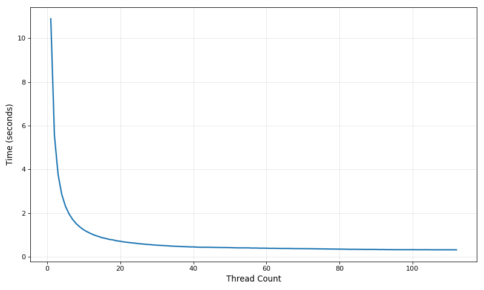
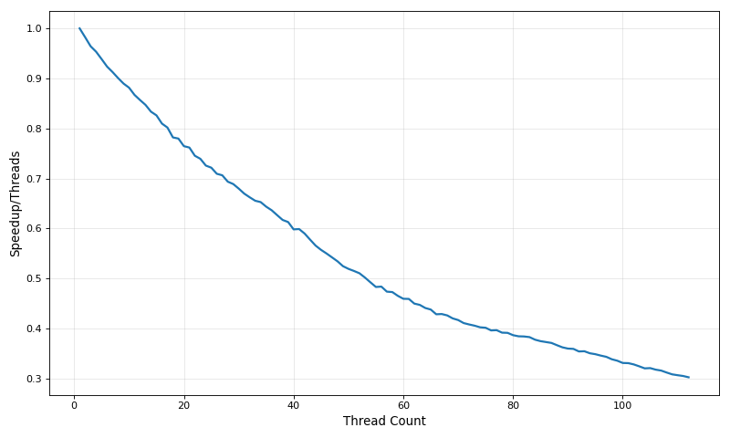

## Preface

I will start with a simple and slow solution, and among other optimizations, I will incorporate some assumptions into the code to make it even faster.  
While making too many assumptions can lead to errors, making the correct assumptions enables very effective optimizations. And this is just a performance challenge with input that is generated from a known range of options, so we can make a lot of assumptions.  
Additionally, this blog post is written as I am optimizing my solution, and not as a retrospective on optimizing it, so it is long and not entirely grouped by the type of optimization used.  
Instead, it shows the spiral nature of performance optimization: targeting the hot spots one by one, and returning to already improved sections to improve them again when their relative run time grows once other parts became faster.  

Almost every variation of the solution shown here can be seen in the GitHub repository linked above.

## Defining The Problem

In this challenge, we are given a text file containing one billion lines, each consisting of a station name, a semi-colon, and a temperature measurement. For example:
```txt
Hamburg;12.0
Bulawayo;8.9
Palembang;38.8
St. John's;15.2
Cracow;12.6
Bridgetown;26.9
Istanbul;6.2
Roseau;34.4
Conakry;31.2
Istanbul;23.0
```
The output of the solution needs to be the minimum, mean average and maximum value seen for each station, rounded to 1 decimal place and sorted alphabetically, in the following format:
```txt
{Abha=-23.0/18.0/59.2, Abidjan=-16.2/26.0/67.3, Abéché=-10.0/29.4/69.0, Accra=-10.1/26.4/66.4, Addis Ababa=-23.7/16.0/67.0, Adelaide=-27.8/17.3/58.5, ...}
```

This kind of problem allows for some impressive performance gains by making assumptions about the inputs, such as:

 - No errors in the text allows skipping any validation.
 - The possible length of station names is known in advance because we have the list of stations before the dataset is generated.
 - We know the range of possible measurements and their precision.

## Generating The Dataset

To generate the dataset, I used the original Java code given in the challenge repository:
```bash
./mvnw clean verify
```
To build the generation code, after spending a while looking for the correct version of JDK that will actually manage to build the project.  
And then waiting a few minutes for the 14GB text file to be generated:
```bash
./create_measurements.sh 1000000000
```

## Benchmarking Methodology

Unless stated otherwise, all measurements in this challenge will be done using [hyperfine](https://github.com/sharkdp/hyperfine), on the same machine equipped with an Intel Core Ultra 7 165H and 32GiB of LPDDR5 Memory running at 6400 MT/s.  
For more stable results and to avoid thermal throttling, until the final benchmark the CPU frequency will be locked to 3.5GHz using `cpupower frequency-set`, and the single-threaded versions will be locked to a single core using `taskset -c 1`.  
Core 1 is specifically chosen to avoid core 0 (and its SMT sibling core 5) which handles some kernel related work, and to ensure the program always runs on a performance core and not an efficiency core, as Intel's newer CPUs utilize a hybrid approach combining two different types of cores on the same CPU.  

> [!NOTE] hyperfine
> [hyperfine](https://github.com/sharkdp/hyperfine) is a simple benchmarking tool that runs a given program many times to generate an average and a range of statistically likely run times.  
> It is useful to very easily measure the run time of complete and short programs in their entirety without modifying or recompiling the code, which fits this challenge.

The measurements file is preloaded into the page cache using [vmtouch](https://github.com/hoytech/vmtouch) to eliminate the overhead of reading it from disk.

```bash
./vmtouch -t ../1brc/measurements.txt
           Files: 1
     Directories: 0
   Touched Pages: 3367990 (12G)
         Elapsed: 16.386 seconds
```

> [!NOTE] vmtouch
> [vmtouch](https://github.com/hoytech/vmtouch) is a useful utility that can show information about, and control the status of files in the file cache.
> Running it without any parameters shows the current status, running it with the `-f` flag reads a single byte from every page in every file to cause them all to be cached, and the `-e` flag evicts a file from the cache. There are a few more useful flags.

## Baseline Measurements

My first step is gauging a rough possible range of run time.

### Lower Bound
By simply reading the entire file without doing any computation, we can roughly approximate the fastest we can go on one core:

```bash
$ taskset -c 1 hyperfine 'cat measurements.txt'
Benchmark 1: cat measurements.txt
  Time (mean ± σ):      1.355 s ±  0.007 s    [User: 0.005 s, System: 1.346 s]
  Range (min … max):    1.347 s …  1.368 s    10 runs
 ```

Note that the entire file is in file cache, so no actual disk I/O is done.

### Upper Bound

The challenge repository also contains a [baseline implementation](https://github.com/gunnarmorling/1brc/blob/main/src/main/java/dev/morling/onebrc/CalculateAverage_baseline.java) in Java, that runs on a single core and does not have any particular optimizations applied to it.  
Of course, my solution could still be slower, but it provides a simple rough upper bound:
```bash
$ taskset -c 1 hyperfine ./calculate_average_baseline.sh
Benchmark 1: ./calculate_average_baseline.sh
  Time (mean ± σ):     137.615 s ±  7.713 s    [User: 134.325 s, System: 2.623 s]
  Range (min … max):   130.097 s … 148.467 s    10 runs
```

So we can expect the solutions to be somewhere in that range.  
As another point of reference, without the CPU frequency setting, the same baseline solution takes **116 seconds** (and the lower bound 1.16 seconds).  


#### Output Verification

I have also saved the output of the baseline solution to compare to my output and verify it.  
All solutions shown in this post have been verified to be identical to the baseline using `cmp`.

> [!NOTE] cmp
> [cmp](https://www.man7.org/linux/man-pages/man1/cmp.1.html) is a standard Linux utility to compare files, and it is often the easiest way to verify two files are identical: if the output of `cmp file1 file2` is empty, the files are identical.
> In the past I used [diff](https://man7.org/linux/man-pages/man1/diff.1.html) for this purpose.  
> `diff` has the advantage of showing all differences, and not just *where* the first difference is like `cmp` does, but `cmp` is a lot faster.

## First Attempt - 95 Seconds

My initial version is the naive solution: 

1. For every line of text:
    1. Split the line into station name and measurement.
    1. Parse the measurement.
    1. Add the measurement to a hash map using the station name as the key.
1. For every station in the hash map, summarize its measurements.
1. Sort the summary.
1. Print the results.

The code for solution is short and simple, and it contains a lot of room for improvement:
```rust
// naive.rs
let file = File::open("measurements.txt").expect("measurements.txt file not found");
let reader = BufReader::new(file);
let mut map = HashMap::<String, Vec<f32>>::new();
for line in reader.lines() {
    let line = line.unwrap();
    let (station_name, measurement) = line.split_once(';').expect("invalid line");
    let measurement_value: f32 = measurement.parse().expect("not a number");
    map.entry(station_name.into())
        .or_default()
        .push(measurement_value);
}
let mut summary: Vec<(&String, f32, f32, f32)> = map
    .iter()
    .map(|(station_name, measurements)| {
        let min = *measurements.iter().min_by(|a, b| a.total_cmp(b)).unwrap();
        let avg = measurements.iter().sum::<f32>() / measurements.len() as f32;
        let max = *measurements.iter().max_by(|a, b| a.total_cmp(b)).unwrap();
        (station_name, min, avg, max)
    })
    .collect();
summary.sort_unstable_by_key(|m| m.0);
print!("{{");
for (station_name, min, avg, max) in summary[..summary.len() - 1].iter() {
    print!("{station_name}={min:.1}/{avg:.1}/{max:.1}, ");
}
let (station_name, min, avg, max) = summary.last().unwrap();
print!("{station_name}={min:.1}/{avg:.1}/{max:.1}}}");
```

This approach of summarizing the measurements at the end instead of while parsing, is obviously not ideal, and it is simple to improve. Even the baseline solution already implemented this improvement, so it's possible that this first solution will be even slower.

This solution passes the verification and it is already faster than the baseline:
```bash
Time (mean ± σ):     95.499 s ±  0.319 s    [User: 91.841 s, System: 3.413 s]
Range (min … max):   95.028 s … 96.116 s    10 runs
```

## Better Compilation Parameters - 89 Seconds

Most of the time I am trying to optimize some Rust code, I use the following Cargo profiles to maximize performance and gather performance metrics:
```Cargo
[profile.max]
inherits = "release"
panic = "abort"
codegen-units = 1
lto = true

[profile.bench]
inherits = "max"
debug = true
strip = false
```

The `max` profile contains the most aggressive optimizations that a profile can apply, and the `bench` profile is the same with the addition of some debugging information that can help debug and gather performance metrics.  
In most cases there will actually be no measurable difference between the two profiles.

> [!WARNING] panic = "abort"
> The `panic = "abort"` setting usually has an immeasurably small effect on normal runtime performance.  
> Outside a scenario where the program panics, the difference is essentially a slightly smaller binary due to not needing the unwinding code.
> When the program *does* panic, setting it to abort skips unwinding the stack and cleaning up resources. That also means that recovering from a panic is no longer possible.

Running the same code with the `max` profile improves the performance a little, to **90 seconds**:
```bash
Time (mean ± σ):     90.245 s ±  0.619 s    [User: 86.582 s, System: 3.426 s]
Range (min … max):   89.227 s … 91.232 s    10 runs
```

We can additionally compile the code specifically for the host CPU, which mostly means allowing the compiler to automatically use all available CPU extensions, such as AVX2 in my case. This is done by creating a file called `config.toml` in a new directory called `.cargo` and writing to it:
```
[build]
rustflags = ["-Ctarget-cpu=native"]
```

This addition shaved off one more second:
```bash
Time (mean ± σ):     89.016 s ±  0.825 s    [User: 85.358 s, System: 3.429 s]
Range (min … max):   88.010 s … 90.681 s    10 runs
```
The current code is not very friendly to vectorization, which often gets the biggest gain from native compilation. This explains why we only see a very small improvement.
I will be using these parameters in the rest of the measurements.

## Optimizing The Wrong Part: Updating The Summary During Parsing - 86 Seconds

The first optimization that comes to mind, which the baseline already does, is that we fortunately (or more likely, it was specifically designed this way) don't actually need to store all the measurements for every station, for any specific station we only need to store the highest measurement, the lowest measurement, the sum of all measurements, and the amount of measurements.  
Using the sum and amount of measurements we can instantly calculate the average at the end of the scan.  
So the new algorithm is:
1. For every line of text:
    1. Split the line into station name and measurement.
    1. Parse the measurement.
    1. Update the hash map with the new min/sum/max/count for that station name
1. Turn the hash map into a summary vector while computing the averages.
1. Sort the summary
1. Print the results

And as code, the updated section looks like this:
```rust
// no_store.rs
let mut summary = HashMap::<String, (f32, f32, f32, i32)>::new();
for line in reader.lines() {
    let line = line.unwrap();
    let (station_name, measurement) = line.split_once(';').expect("invalid line");
    let measurement_value: f32 = measurement.parse().expect("not a number");
    summary
        .entry(station_name.into())
        .and_modify(|(min, sum, max, count)| {
            *min = min.min(measurement_value);
            *sum += measurement_value;
            *max = max.max(measurement_value);
            *count += 1;
        })
        .or_insert((measurement_value, measurement_value, measurement_value, 1));
}
let mut summary: Vec<(String, f32, f32, f32)> = summary
    .into_iter()
    .map(|(station_name, (min, sum, max, count))| (station_name, min, sum / count as f32, max))
    .collect();
summary.sort_unstable_by(|m1, m2| m1.0.cmp(&m2.0));
```

And running the code now results in:
```bash
Time (mean ± σ):     86.487 s ±  0.404 s    [User: 84.134 s, System: 2.151 s]
Range (min … max):   85.941 s … 86.997 s    10 runs
```

It is faster, but the improvement is much smaller than I expected. Why?

### Reading Flamegraphs

Flamegraphs are a way to visualize the time a program spent in every function in the code, and here it can show us how much did the previous solution spend in gathering the measurements, which should consist mostly of reallocating the vectors the measurements are stored in.  
In Rust, the easiest way to generate flamegraphs is using [cargo-flamegraph](https://github.com/flamegraph-rs/flamegraph).  
After installing the package, it can be run using:
```
cargo flamegraph --profile bench
```
I am using the `bench` profile because the flamegraph generation needs the debug information to give any useful results.

The resulting flamegraph shows this rough breakdown of the time:

 - `read_line` - 34.9%
 - `str::parse` - 8.7%
 - `str::split_once` - 5%
 - `HashMap::entry` - 26.2%

 And the rest spread in various other parts of the code, that don't take enough time to be important yet.
 
So targeting the measurements vectors was not a great decision, which would have been more obvious if measured before applying this optimization, but at least it takes up significantly less memory, which can be measured using `/bin/time -v`, which shows the "maximum resident set size" used by the program (this output is from the first solution):

```bash
	User time (seconds): 85.25
	System time (seconds): 3.48
	Percent of CPU this job got: 99%
	Elapsed (wall clock) time (h:mm:ss or m:ss): 1:28.91
	Average shared text size (kbytes): 0
	Average unshared data size (kbytes): 0
	Average stack size (kbytes): 0
	Average total size (kbytes): 0
	Maximum resident set size (kbytes): 4201520
	Average resident set size (kbytes): 0
	Major (requiring I/O) page faults: 0
	Minor (reclaiming a frame) page faults: 742454
	Voluntary context switches: 1
	Involuntary context switches: 545
	Swaps: 0
	File system inputs: 0
	File system outputs: 0
	Socket messages sent: 0
	Socket messages received: 0
	Signals delivered: 0
	Page size (bytes): 4096
	Exit status: 0
```

> [!WARNING] time
> `time` is also a built-in command in many shells, which do not support the `-v` flag, so to invoke the actual `time` program, the full path `/bin/time` must be used (and might need to be installed via your package manager).

The original solution peaks at `4201520 KB`, or about `4 GB`, which fits with the one billion 4 byte floats it needs to store.  
In comparison, the new version peaks at only `2196 KB`, or about `2 MB`, 2000 times less than the original solution:
```bash
Maximum resident set size (kbytes): 2196
```

Generating a flamegraph for the new version shows roughly the same breakdown of time as before.

## Optimizing The Right Part: A New Parser - 59 Seconds

The [generated flamegraph](flamegraph1.svg) shows that a quarter of the time is spent in `readline`, and almost 15% is spent in the rest of the parsing. It also shows that there is effectively nothing to gain improving the sorting phase as it is so short it does not even appear on the flamegraph.  
Digging down more into `readline`, we can see that its time is split very roughly equally between UTF-8 validation, vector allocation and searching for the line separator (using `memchr`).  
These are all things that can be improved by writing a new parser.

### Bytes Are Faster Than Chars

Reading the file as an array of bytes into a pre-allocated buffer allows the line splitting to speed up, and already gives a measurable speedup to lowering the run time to **75 seconds**:
```rust
// bytes.rs
...
let mut buffer = Vec::new();
while reader.read_until(b'\n', &mut buffer).unwrap() != 0 {
    let line = std::str::from_utf8(&buffer[..buffer.len()-1]).unwrap();
    ...
    buffer.clear();
}
...
```

This still works despite the input containing some non-ASCII characters in station names because those are taken whole, and they will be turned back to UTF-8 strings later.  
The conversion to `&str` and later scanning over it eliminates a lot of the gain, and I will solve that later.  

### Measurement Value Parsing

One useful observation is that all measurements are always in the range -99.9 to 99.9, and always have exactly 1 decimal digit, so we can actually parse it more easily into an integer (with its units being tenths of degrees), and only convert it back to the expected format at the end.

This is not necessarily the fastest implementation under these constraints, but it will do for now:

```rust
// bytes.rs
fn parse_measurement(text: &[u8]) -> i32 {
    if text[0] == b'-' {
        -parse_measurement_pos(&text[1..])
    } else {
        parse_measurement_pos(text)
    }
}
fn parse_measurement_pos(text: &[u8]) -> i32 {
    if text[1] == b'.' {
        // 1 digit number
        (text[0] - b'0') as i32 * 10 + (text[2] - b'0') as i32
    } else {
        // 2 digit number
        (text[0] - b'0') as i32 * 100 + (text[1] - b'0') as i32 * 10 + (text[3] - b'0') as i32
    }
}
```

The main change to the rest of the code is that the hash map now holds `i32`s, and that they are being converted to `f32` and divided by 10 after parsing.

This solution has 2 main benefits over the standard `str::parse<f32>`:

- It does not require parsing the byte slice into a string slice, which includes a validation if not using the unsafe unchecked variation.
- It utilizes the known constraints of the values to do the minimum amount of work.

Using the new value parsing reduces the run time to **64 seconds**, and looking at a [new flamegraph](flamegraph2.svg), it reduced the value parsing related section from 9% to 2.6%.  
The hash map part of the run time is getting bigger with every optimization, I'll tackle it after one more small optimization to the parsing.

### Slightly Faster Line Splitting

We know that the separating `;` is always in the last 7 bytes of a line, because every line has its line break, and at most 5 bytes related to the measurement value, so we can just skip to that part of the line:
```rust
// bytes.rs
let first_possible_split = buffer.len() - 7;
let split_pos = buffer[first_possible_split..]
    .iter()
    .position(|c| *c == b';')
    .unwrap()
    + first_possible_split;
let (station_name, measurement) = buffer.split_at(split_pos);
```

This optimization saves a few more seconds, for a total run time of **59 seconds** and shrinking the relative time spent in `position`:
```bash
Time (mean ± σ):     59.171 s ±  0.528 s    [User: 56.978 s, System: 2.031 s]
Range (min … max):   58.439 s … 60.107 s    10 runs
```

I also tried splitting the reading of a line into 2: reading up to the `;` and then up to the `\n`, but that ended up being slower.  

## Faster Hash Map - 27 Seconds

### Hashing Less

My first idea was to eliminate the use of `Vec` as the hash map key by using `[u8;32]` keys, which can fit any of the possible station names:  
```rust
// faster_hash_map.rs
...
let mut summary = HashMap::<[u8; 32], (i32, i32, i32, i32)>::new();
...
    let mut station_name_array = [0u8; 32];
    station_name_array[..station_name.len()].copy_from_slice(station_name);
    summary
        .entry(station_name_array)
...
```
Unfortunately, while it replaced the time spent allocating a vector with a shorter time copying a slice, it also increased the time spent hashing, so the entire program ended up being slightly slower.  
Hashing 32 bytes every time is slow, and the default hasher hashes every byte individually, as we can see on the [flamegraph](flamegraph3.svg): hashing takes up 17% of the time, and the hasher calls `u8::hash_slice` which calls the hash function for every individual byte. Additionally, it hashes the length of the slice as well, which is unnecessary.  
Instead, I wrote a new struct for the station name, that implements a custom hash for the station name, that only takes the first 8 bytes as a `u64` and hashes that:
```rust
// faster_hash_map.rs
#[derive(Eq, PartialEq)]
struct StationName([u8; 32]);

impl Hash for StationName {
    fn hash<H: std::hash::Hasher>(&self, state: &mut H) {
        let ptr = self.0.as_ptr() as *const u64;
        unsafe { ptr.read_unaligned() }.hash(state);
    }
}
impl From<&[u8]> for StationName {
    fn from(source: &[u8]) -> Self {
        let mut s = Self([0; 32]);
        s.0[..source.len()].copy_from_slice(source);
        s
    }
}
impl From<StationName> for String {
    fn from(val: StationName) -> Self {
        String::from_str(std::str::from_utf8(&val.0).unwrap()).unwrap()
    }
}
```

And using it as the key to the hash map. Not using all the bytes could increase the collision rate in the hash map, but the station names are varied enough that almost no pair of stations share the same first 8 bytes.    
This takes the run time down to **47 seconds**.  

There is no point in hashing less than 8 bytes at a time because every smaller size will just get automatically extended to 8 bytes if it is smaller, before the hashing (in the default hasher and many other hashers).

### Hashing Faster

Instead of hashing less times or hashing less bytes, we can replace the hashing function itself, there are many crates that offer different hashing algorithm, so I tried several of the most popular options:

- `ahash::AHashMap`: improved the run time to **39 seconds**.
- `fnv::FnvHashMap`: improved the run time to **43.6 seconds**.
- `rustc-hash::FxHashMap`: improved the run time to **34.8 seconds**.
- `hashbrown::hash_map::HashMap`: improved the run time to **35.3 seconds**.

I also tried `nohash-hasher::NoHashHasher` which does not actually do any hashing and just passes the `u64` as the hash, which can be useful when the keys are already random, but since the keys are not random, this very weak "hash" function worsened the run time to **103 seconds**

So I'll continue with `FxHashMap`.

## Mapping Is Faster Than Reading (In This Case) - 27.7 seconds

Up until now I relied on `BufReader` to get the data from the file, one common alternative way to read data from a file is using `mmap`.  
`mmap` is a system call that maps a file into memory, making it appear to the program as a big array that can be read directly, it can even map files much larger than the system memory can contain.  
Of course, the file is not copied into system memory until it is needed, but that part is handled by the operating system during page faults.
To use `mmap` in Rust, you can use a crate such as `memmap` or its replacement, `memmap2`, or you can call `mmap` system call directly via the `libc` crate, like `memmap` and `memmap2` do:

```rust
// use_mmap.rs
fn map_file(file: &File) -> Result<&[u8], Error> {
    let mapped_length = file.metadata().unwrap().len() as usize;
    match unsafe {
        libc::mmap(
            std::ptr::null_mut(),
            mapped_length,
            libc::PROT_READ,
            libc::MAP_SHARED,
            file.as_raw_fd(),
            0,
        )
    } {
        libc::MAP_FAILED => Err(Error::last_os_error()),
        ptr => {
            unsafe { libc::madvise(ptr, mapped_length, libc::MADV_SEQUENTIAL) };
            Ok(unsafe { from_raw_parts(ptr as *const u8, mapped_length) })
        }
    }
}
```

Now the iterator needs to be updated to use a slice:
```rust
// use_mmap.rs
...
let mapped_file = map_file(&file).unwrap();
for line in mapped_file.split(|c| *c == b'\n')
    if line.is_empty() { // the last item in the iterator will be an empty line
      break;
    }
    ...
```

This change improves the run time to **27.8 seconds**

I then tried splitting the reading of the line into reading up to `;` and then up to `\n` again:
```rust
// use_mmap.rs
let mut remainder = &*mapped_file; // get to the underlying slice
while !remainder.is_empty() {
    let station_name_slice: &[u8];
    let measurement_slice: &[u8];
    (station_name_slice, remainder) =
        remainder.split_at(remainder.iter().position(|c| *c == b';').unwrap());
    remainder = &remainder[1..]; //skip ';';
    (measurement_slice, remainder) =
        remainder.split_at(remainder.iter().position(|c| *c == b'\n').unwrap());
    remainder = &remainder[1..]; //skip \n;
```

And it is very slightly faster now, at **27.7 seconds**:
```bash
Time (mean ± σ):     27.721 s ±  0.105 s    [User: 27.202 s, System: 0.410 s]
Range (min … max):   27.637 s … 27.889 s    10 runs
```

The updated [flamegraph](flamegraph4.svg) shows 2 things:

- Reading the file disappeared completely from the flamegraph
- `position` is becoming a considerable bottleneck again (especially now that we are using it twice)

The reason we can't see the reading itself at all is also part of the reason `position` takes such a long time now: there is no dedicated section of code for getting the bytes from the file into the program, it is done entirely during page faults, which are attributed to the assembly instructions that cause the faults.  
These instructions would mostly be inside `position`, since it is the first to touch any line of text.

> [!NOTE] Page Faults
> As I explained before, `mmap` does not actually copy the entire file into memory, it just makes it appear to be in memory.  
> When the program tries to access a part of the file, the CPU detects that the memory page (a small section of memory, 4KiB unless using huge pages) containing the accessed address is not mapped for the process, and causes a page fault, which pauses the program and transfers control to the OS to handle it.  
> The page fault is handled by the operating system, which copies the missing page from the file into memory if it is not already in the page cache, points the process' page table at the page that was just read (or was already in the page cache), and then control can be given back to the program, which will read the value as if nothing happened.
> In this case, the file is always in the page cache because of a previous warm-up run when the performance is measured. Measuring the performance with a cold cache shows a significant increase in run time.

## memchr - 26.1 seconds

`memchr` is a crate that provides optimized functions to search in byte slices. It uses SIMD instructions to make finding specific bytes extremely fast.

Using it is as simple as replacing the `position` calls with `memchr` calls:
```rust
// use_memchr.rs
    ...
    (station_name_slice, remainder) = remainder.split_at(memchr(b';', remainder).unwrap());
    remainder = &remainder[1..]; //skip ';';
    (measurement_slice, remainder) = remainder.split_at(memchr(b'\n', remainder).unwrap());
    remainder = &remainder[1..]; //skip \n;
    ...
```

This change improves the runtime to **26.1 seconds**:
```bash
Time (mean ± σ):     26.059 s ±  0.228 s    [User: 25.446 s, System: 0.411 s]
Range (min … max):   25.778 s … 26.376 s    10 runs

```
Not as big of an improvement as I expected, but still a win.


## Eliminating Copies - 25 seconds

In all previous versions, the station name had to be copied into a new vector/array in order to use it, and looking at an updated [flamegraph](flamegraph5.svg), 17% of the run time is spent in `StationName::from<&[u8]>`, which consists of copying the slice into the 32 byte array.  
Instead, I want to store a reference to the slice instead of copying it.  
This also allows arbitrarily long station names, and not only 32 bytes long ones (despite the longest possible name from the generator is shorter than 32 bytes, the rules specify up to 100 bytes should be supported).

So I converted `StationName` to simply hold a reference to the slice:
```rust
// station_name_slice.rs
#[derive(Eq, PartialEq)]
struct StationName<'a>(&'a [u8]);

impl<'a> Hash for StationName<'a> {
    fn hash<H: std::hash::Hasher>(&self, state: &mut H) {
        let mut num = 0u64;
        for c in &self.0[..8.min(self.0.len())] {
            num = (num << 8) + *c as u64;
        }
        num.hash(state);
    }
}
```

> [!Important] Impossible Without Mapping
> It is important to note that storing the slices like this was impossible when we read the file using `BufReader`, since the line was lost after every iteration.
> But using the mapped file, the slice is always mapped in memory, and even if it is swapped out by the operating system due to low memory, it will be swapped back in like nothing happened when the slice is read.

This solution runs faster, at **25 seconds**:
```bash
Time (mean ± σ):     25.029 s ±  0.203 s    [User: 24.237 s, System: 0.426 s]
Range (min … max):   24.812 s … 25.260 s    10 runs
```

### Fixing Hashing Again - 19.2 seconds

The new `StationName` can't be read as a `u64` like it was before, because there are unknown bytes past the `;`, which will make the generated hash inconsistent.  
Additionally, a [new flamegraph](flamegraph6.svg) shows that the byte by byte hashing is again very slow, taking 9.6% of the time.  
To solve that, one solution is to notice that all possible station names *are* at least 3 bytes, and with the separating `;` character, the first 4 bytes are consistent for the same station.  
So by taking the `;` along with the station name (and stripping it during printing), hashing 4 bytes at a time is possible.  
```rust
// station_name_slice.rs
fn hash<H: std::hash::Hasher>(&self, state: &mut H) {
    let ptr = self.0.as_ptr() as *const u32;
    unsafe { ptr.read_unaligned() }.hash(state);
}
```
The run time has now improved to **19.2 seconds**:
```bash
Time (mean ± σ):     19.216 s ±  0.033 s    [User: 18.747 s, System: 0.416 s]
Range (min … max):   19.179 s … 19.258 s    10 runs
```

And looking at the [flamegraph](flamegraph7.svg), `make_hash` shrunk to just 1.7%.

The issue with this hash implementation is that despite the shortest possible station name created by the generator being 3 bytes long, the rules actually specify that that length of a name can be as short as 1 byte.  
Adding a fallback that hashes the name byte by byte if it is too short does affect the performance even if the branch predictor should perfectly predict it:
```bash
Time (mean ± σ):     19.510 s ±  0.098 s    [User: 18.772 s, System: 0.412 s]
Range (min … max):   19.386 s … 19.632 s    10 runs
```
To keep things more interesting, I will be making the assumption that station names are between 3 and 26 bytes, as they are in the possible generated names.  

### 2 Rule Sets

At this point, I will separate the solution into 2 versions:

#### Non-compliant Version

It must work on any measurements file generated from the file generation code.  
That means the possible station names are known, and they are all 3-27 bytes.  

Unless stated otherwise (at the end of the post), this is the version I am optimizing for.

#### Compliant Version

It must meet the official rules, meaning there are up to 10000 different names, each between 1 and 100 bytes.

## Optimizing Line Splitting Again - 15.1 seconds

The optimizations made since adding the usage of `memchr` made its relative time grow to 22.1%, so it is probably time to take another look at it.  
Taking another look at out assumptions opens up the next optimization:  
The longest possible station name has 26 bytes, and the longest measurement has 5 bytes, along with the `;` and `\n`, we get 33 bytes at most per line.  
Additionally, we know the shortest station name is 3 bytes, so we really only need to look at 30 bytes, but that is actually not important with this optimization.  
Fortunately, most modern machines have 256-bit SIMD registers, which are 32 bytes, enough to fit an entire line.

> [!NOTE] SIMD
> SIMD stands for "Single Instruction, Multiple Data", and it refers to a set of registers available on most CPUs that are capable of applying computations to multiple values at once, each taking only a part of the register. These registers can have different sizes depending on the CPU architecture.  
> For example, 256-bit SIMD registers can fit 32 1 byte values, 16 2 byte values, 8 4 byte values, or 4 8 byte values.  
> Common operations supported by SIMD registers are operations such as load, store, addition,comparison, etc.
> In this case we are working with `u8` values, so I'll be using the 256-bit SIMD register for 32 `u8` values at once.
> The group of values stored in a SIMD register are often also called a vector.

`memchr` already uses SIMD for its searching, but it does not know that the values I'm searching for will *always* be within the first 33 bytes.  
To find a byte within a SIMD register containing the line, we need to compare it to another SIMD register containing the byte we are searching for at every position:

### Using SIMD Intrinsics In Rust

There are a few ways to use SIMD in Rust, the two main ways are:

- `std::simd`: a portable SIMD module that uses a generic `Simd<T,N>` type to represent all SIMD variables, and compiles them to the best available native SIMD types depending on the compilation flags (I have set `-Ctarget-cpu=native`, so it should be using the 256-bit registers that are available).  
  These portable types have 2 downsides: The first is that they only have a subset of the available operations, since they must work on supported platform and not just one specific extension. And the second is that they are nightly only and require a feature flag.
 - `core::arch`: A module containing modules for every supported architecture, such as `x86_64` or `arm`, each containing the available SIMD intrinsics for that architecture.  
  Even within a specific architecture there is a separation between different extensions, since some operations are only available on a specific extension of a specific architecture.

This time I chose to use `core::arch`.  
To actually use these instructions we must tell the compiler that our machine has the required capabilities:
```rust
// use_simd.rs
#[cfg(target_feature = "avx2")]
#[target_feature(enable = "avx2")]
fn read_line(text: &[u8]) -> (&[u8], &[u8], &[u8]) {
    todo!()
}
```

`#[cfg(target_feature = "avx2")]` causes the function to only be compiled if the feature is enabled, and `#[target_feature(enable = "avx2")]` allows using `AVX2` operations inside the function without `unsafe`.  
So now we can to use any SIMD operation that requires the `AVX2` (or any of the extensions it is a superset of, such as `SSE` and `AVX`) inside the function.

I am not planning to run this code on any machine that does not support `AVX2`, but I might as well support doing that.  
We can put the old parsing code in a function that will only be compiled if `AVX2` is *not* available:

```rust
// use_simd.rs
#[cfg(not(target_feature = "avx2"))]
fn read_line(mut text: &[u8]) -> (&[u8], &[u8], &[u8]) {
    let station_name_slice: &[u8];
    let measurement_slice: &[u8];
    (station_name_slice, text) = text.split_at(memchr(b';', &text[3..]).unwrap() + 3);
    text = &text[1..]; //skip ';';
    (measurement_slice, text) = text.split_at(memchr(b'\n', &text[3..]).unwrap() + 3);
    text = &text[1..]; //skip \n;
    (text, station_name_slice, measurement_slice)
}
```

### Finding Bytes With SIMD

In this section, I'll be using the longest line in my input file:

First, comparing it to a SIMD full of `;`:

```rust
let separator: __m256i = _mm256_set1_epi8(b';' as i8);
let separator_mask = _mm256_cmpeq_epi8(line, separator);
```

```
L a s   P a l m a s   d e   G r a n   C a n a r i a ; - 1 0 . 4
‖ ‖ ‖ ‖ ‖ ‖ ‖ ‖ ‖ ‖ ‖ ‖ ‖ ‖ ‖ ‖ ‖ ‖ ‖ ‖ ‖ ‖ ‖ ‖ ‖ ‖ ‖ ‖ ‖ ‖ ‖ ‖
; ; ; ; ; ; ; ; ; ; ; ; ; ; ; ; ; ; ; ; ; ; ; ; ; ; ; ; ; ; ; ;
↓ ↓ ↓ ↓ ↓ ↓ ↓ ↓ ↓ ↓ ↓ ↓ ↓ ↓ ↓ ↓ ↓ ↓ ↓ ↓ ↓ ↓ ↓ ↓ ↓ ↓ ↓ ↓ ↓ ↓ ↓ ↓
0 0 0 0 0 0 0 0 0 0 0 0 0 0 0 0 0 0 0 0 0 0 0 0 0 0 1 0 0 0 0 0 
```

The result is a SIMD full of 0s and a single 1 at the position of the `;` we are looking for.

Next, the result is converted from a SIMD vector to a `u32`:

```rust
let separator_mask_u32 = _mm256_movemask_epi8(separator_mask);
```

Now the position is encoded in a `u32` and not a 256-bit register, so we can use `trailing_zeroes` to get the actual position:
```rust
let separator_pos = separator_mask_u32.trailing_zeroes();
```

`trailing_zeroes` returns the amount of consecutive 0 bits there are in the value starting from the least significant bit.


> [!Important] Trailing Or Leading?
> When first writing this code I accidentally used `leading_zeroes`, because I expected the `u32` to look the same as the SIMD register but packed, but the `u32` stores the bits from least to most significant, which means bit 0(the right-most one) of the `u32` corresponds to the first byte in the SIMD register(the one with the smallest address).

Finding the position of the `\n` is the same, but it is worth noting that if the line is of the maximum length of 33, the `\n` will not appear in the loaded SIMD.  
But that is okay, because this check will return a mask of all 0s, which means `trailing_zeroes` returns 32, the correct position.  
If the longest line was longer than 35 bytes (because we could skip the first 3 if needed), this method would not work.

The full function looks like this:
```rust
// use_simd.rs
#[cfg(target_feature = "avx2")]
#[target_feature(enable = "avx2")]
fn read_line(text: &[u8]) -> (&[u8], &[u8], &[u8]) {
    let separator: __m256i = _mm256_set1_epi8(b';' as i8);
    let line_break: __m256i = _mm256_set1_epi8(b'\n' as i8);
    let line: __m256i = unsafe { _mm256_loadu_si256(text.as_ptr() as *const __m256i) };
    let separator_mask = _mm256_movemask_epi8(_mm256_cmpeq_epi8(line, separator));
    let line_break_mask = _mm256_movemask_epi8(_mm256_cmpeq_epi8(line, line_break));
    let separator_pos = separator_mask.trailing_zeros() as usize;
    let line_break_pos = line_break_mask.trailing_zeros() as usize;
    (
        &text[line_break_pos + 1..],
        &text[..separator_pos],
        &text[separator_pos + 1..line_break_pos],
    )
}
```

As is, there is UB here, since reading the last line can go past the memory of the slice, to fix this I mapped 32 extra bytes so I can read and ignore them without UB:

```rust
// use_simd.rs
fn map_file(file: &File) -> Result<&[u8], Error> {
    let mapped_length = file.metadata().unwrap().len() as usize + 32;
    ...
}
...
while (remainder.len() - 32) != 0 {
  ...
```

> [!WARNING] Undefined Behaviour
> Undefined behaviour (or UB), refers to code whose execution is not defined by the programming language, for example, reading and writing to arbitrary memory locations.  
> When a piece of code contains UB, the compiler is allowed to do many things, including crash, silently ignore it, or do any other read/write.computation.  
> In this case, I am reading past the end of the array, which is considered UB.  
> If the end of the array happens to be at the end of a memory page, it is very likely that the program will crash when trying to load the last line.

The new version is faster, running for **14.9 seconds**:
```bash
Time (mean ± σ):     14.938 s ±  0.104 s    [User: 14.500 s, System: 0.400 s]
Range (min … max):   14.788 s … 15.144 s    10 runs
```

An updated [flamegraph](flamegraph8.svg) shows that the time to read and split a line has shrunk from 22.1% to 9.1%.

## Revisiting The Hash Map: Faster Comparison - 11.3 seconds

The flame graph now shows 2 major potential spots for improvement:

- `parse_measurement`: takes 16% of the time, it should be possible to improve with some very complicated SIMD code.
- `[u8]::eq` (called inside the hash map): takes 33% of the time, might be possible to improve it by comparing using SIMD if the standard implementation does not already do it, and might be possible to improve it by simply calling it less, which means reducing the amount of collisions in the hash map.

I decided to look into the slice comparisons first.  
Until now I have only looked at replacing the entire hash map and making hashing faster, but another part of the operations of the hash map is comparing keys directly to find the correct item. This includes calling `[u8]::eq` at least once per lookup, and there is a huge amount of lookups in the program.
In an attempt to reduce collisions, I tried preallocating the hash map with more capacity than it has at the end of the run, so I set it to 1024.  
The run time did appear to very slightly improve, to **14.7 seconds**:
```bash
Time (mean ± σ):     14.693 s ±  0.038 s    [User: 14.257 s, System: 0.399 s]
Range (min … max):   14.603 s … 14.740 s    10 runs
```
But looking at a flamegraph, the time spent comparing did not change, and there was never a significant time spent reallocating to begin with.  
So I tried increasing the capacity to a more extreme value of `2**20`, which slowed it down, and still did not change the time taken by comparisons.  
So there are probably not as many collisions as I thought there are to begin with.  
I am not sure what exactly caused the time to improve, and counting cycles with `perf stat -e cycles` also confirms that the version preallocating with a capacity of 1024 consumed less cycles, and `perf stat` (the default metrics) shows that it has 0.2% less branch mispredictions, so I am going to keep it like that.  
Other values for the capacity lead to an equal or worse time.

So instead of reducing the amount of comparison, I need to make every comparison faster.  
We know that we can fit every station name in a 256-bit SIMD register, but AVX2 does not have operations that select which bytes to load (which are known as masked operations), which are only available in the newer AVX512.

Fortunately, we know that there are 32 bytes to read from the start of every station name, so we could load them all and simply ignore the irrelevant ones.  
The problem with doing that is that simply loading 32 bytes when the slice might be shorter than 32 bytes is undefined behaviour, even if we know that the slice came from a bigger slice that *does* allow this wide load.  

To solve this issue, I had to turn the `StationName` struct into a pair of pointer and a length:
```rust
// simd_eq.rs
struct StationName {
    ptr: *const u8,
    len: u8,
}

impl Hash for StationName {
    fn hash<H: std::hash::Hasher>(&self, state: &mut H) {
        let ptr = self.ptr as *const u32;
        unsafe { ptr.read_unaligned() }.hash(state);
    }
}
impl From<StationName> for String {
    fn from(StationName { ptr, len }: StationName) -> Self {
        let slice = unsafe { from_raw_parts(ptr, len as usize) };
        String::from_str(std::str::from_utf8(slice).unwrap()).unwrap()
    }
}
```

So now I need to implement `Eq` myself:  
First we need to verify that both names are the same length, this also allows us to exit early if they are not:
```rust
if self.len != other.len {
    return false;
}
```

Then we load both names:

```rust
let s = unsafe { _mm256_loadu_si256(self.ptr as *const __m256i) };
let o = unsafe { _mm256_loadu_si256(other.ptr as *const __m256i) };
```

And then we create a mask of only the bytes we care about:
```rust
let mask = (1 << self.len) - 1;
```
For example, for a name with a length of 5, it will create the mask `0b00000000000000000000000000011111`.

And create a `u32` that says exactly which bytes differ:
```rust
let diff = _mm256_movemask_epi8(_mm256_cmpeq_epi8(s, o)) as u32;
```

Which looks something like this:

```
A l e x a n d r a ? ? ? ? ? ? ? ? ? ? ? ? ? ? ? ? ? ? ? ? ? ? ?
‖ ‖ ‖ ‖ ‖ ‖ ‖ ‖ ‖ ‖ ‖ ‖ ‖ ‖ ‖ ‖ ‖ ‖ ‖ ‖ ‖ ‖ ‖ ‖ ‖ ‖ ‖ ‖ ‖ ‖ ‖ ‖
A l e x a n d r i a ? ? ? ? ? ? ? ? ? ? ? ? ? ? ? ? ? ? ? ? ? ?
↓ ↓ ↓ ↓ ↓ ↓ ↓ ↓ ↓ ↓ ↓ ↓ ↓ ↓ ↓ ↓ ↓ ↓ ↓ ↓ ↓ ↓ ↓ ↓ ↓ ↓ ↓ ↓ ↓ ↓ ↓ ↓
1 1 1 1 1 1 1 1 0 ? ? ? ? ? ? ? ? ? ? ? ? ? ? ? ? ? ? ? ? ? ? ?
```

With the `?` being unknown values that we do not care about. Remember that integers are stored in little-endian order, which means the result is stored in reverse order in `diff`.  

And finally, combining the mask and the difference value tells us whether the names are the same:
```rust
diff & mask == mask
```

So the full function looks like this:
```rust
// simd_eq.rs
impl StationName {
    #[cfg(target_feature = "avx2")]
    #[target_feature(enable = "avx2")]
    fn eq_inner(&self, other: &Self) -> bool {
        if self.len != other.len {
          return false;
        }
        let s = unsafe { _mm256_loadu_si256(self.ptr as *const __m256i) };
        let o = unsafe { _mm256_loadu_si256(other.ptr as *const __m256i) };
        let mask = (1 << self.len) - 1;
        let diff = _mm256_movemask_epi8(_mm256_cmpeq_epi8(s, o)) as u32;
        diff & mask == mask
    }
    #[cfg(not(target_feature = "avx2"))]
    fn eq_inner(&self, other: &Self) -> bool {
        let self_slice = unsafe { from_raw_parts(self.ptr, self.len as usize) };
        let other_slice = unsafe { from_raw_parts(other.ptr, other.len as usize) };
        self_slice == other_slice
    }
}
impl PartialEq for StationName {
    fn eq(&self, other: &Self) -> bool {
        unsafe { self.eq_inner(other) }
    }
}
```

In this case I have to use an extra function for the conditional compilation because `eq` is defined by the trait to be safe, and conditional compilation functions are always unsafe, so this is the solution.

Testing the run time again shows an impressive improvement, down to **11.3 seconds**:
```bash
Time (mean ± σ):     11.337 s ±  0.005 s    [User: 10.899 s, System: 0.410 s]
Range (min … max):   11.330 s … 11.343 s    10 runs
```

## Branch-Less Measurement Parsing - 8.38 seconds

At this stage I wanted to check how much of the time the program waits for data to come from memory using `perf stat -M TopDownL2`, and instead of a very high `tma_memory_bound` which indicates that, I saw:
```
3.1 %  tma_memory_bound       
33.2 %  tma_branch_mispredicts
```
Which indicates that only 3.1% of the time is spent waiting for memory, and an extremely high 33.2% of the time is wasted on branch mispredictions.  
Running a plain `perf stat` with the default metrics (which include branch mispredictions), show that 3.3% of branches were mispredicted, that is usually a very high number.  
To see exactly where the mispredictions happen, I used `perf record -e branch-misses:pp` to generate a profile showing which branches specifically were mispredicted often.

The generated report shows 3 major spots where branch mispredictions occur:

The first is checking for the `.` before the decimal number, contributing 45% of the branch misses:
```asm
Percent │
        │     if text[1] == b'.' {
        │     ↓ jmp          43e
   0.01 │3d0:   cmp          $0x1,%esi
        │     ↓ je           aea
        │       movzbl       0x1(%rax),%r9d
  42.66 │       cmp          $0x2e,%r9b
   2.67 │     ↓ jne          450
```

The second is the length comparison when comparing station names, contributing 25% of the branch misses:
```asm
Percent │
        │     if self.len != other.len {
   3.68 │    ┌──cmp          %bpl,-0x18(%rdi)
  21.73 │    ├──jne          22a
```

And the third is again in the measurement parsing, checking if the measurement is negative, contributing another 25% of the misses (there is another copy of these instructions later with another 4%):
```asm
Percent │
        │     if text[0] == b'-' {
        │       movzbl       (%rax),%r8d
  21.28 │       cmp          $0x2d,%r8b
   0.16 │     ↓ jne          3d0
```

This makes sense as we've seen that it now makes up a more significant amount of the time, and it contains two very hard to predict branches.

There is no way I can think of to eliminate the length comparison. Even if there was, it is an early-exit branch, so any other method will likely be slower.  

One way to eliminate the cost of branch mispredictions is to write branch-less code, which means writing code that contains no branch instructions while achieving the same result.  
Branch-less code is often harder to write, and is sometimes slower than the branching version when the branch is predicated well by the CPU, but this is not the case here.  
Two useful tools for branch-less programming are the conditional move instruction, and array indexing using booleans.  

### The Conditional Move Instruction In x86

The `cmove` instruction (and its variants), take 2 parameters: 1 destination register and 1 source register, and it copies the value of the source register if the last comparison done was true by checking the comparison flag in the CPU.  

For example:

```asm
cmp          $0x2d,%al
cmove        %r10d,%ebx
```
Moves the value in register `ebx` into register `r10d` only of the value in register `al` is equal to `0x2d`.  
Conditional move instructions operate based on CPU flags that are set whenever values are compared, and the basic `cmove` operates if the values were equal (Other variations can be found [here](https://www.felixcloutier.com/x86/cmovcc)).

### Indexing Using Booleans

The CPU is able to use comparison results as indexes, for example, the `sete` instruction stores the equality flag into a register that can be used like any other value.  
That means that if we store 2 possible results in an array, we can use the flag we stored as an index into it.

For example:
```asm
  xor          %r9d,%r9d
  cmp          $0x2d,%al
  sete         %r9b
  movzbl       (%r9,%r8,1),%r8d
```
This code:

1. Zeros the register `r9`.  
1. Compares the value in register `al` to the value `0x2d`.  
1. Saves the comparison result in `r9b` (the lower byte of `r9`).  
1. Loads the value from the address that is the sum of the values in `r8` and `r9`, into the register `r8d`.  

That means that after these instructions run, `r8d` will contain the value at `r9` if `al` does not contain `0x2d`, and the value at `r9 + 1` if it contains a different value.  

Another way to index using a comparison is by multiplying the stored flag with an index, that way the result will be 0 if the flag was 0.

### Encouraging The Compiler To Avoid Branches

Usually there is no need to explicitly write these instruction manually, and instead we write code in a way that encourages the compiler to use it, for example:

```rust
let bonus = if team = TEAM::BLUE{
  5
}else{
  10
}
```

In other languages, ternary operators (which do not exist in Rust) often achieve a similar result, and sometimes using an array of size 2 and indexing into it also helps achieve this:

```rust
let bonus_options = [10,5];
let bonus = bonus_options[(team==TEAM::BLUE) as usize];
```

Alternatively, multiplying by a boolean cast to a number often achieves a similar result:

```rust
let bonus = 10-(5*(team==TEAM::BLUE as i32));
```

 #### Rust's Branch-less Hint

In addition to these, the Rust standard library has the `std::hint::select_unpredictable` [function](https://doc.rust-lang.org/stable/std/hint/fn.select_unpredictable.html), which is functionally identical to the `if b { val1 } else { val2}` format I showed, but it is supposed to be more reliable at generating conditional moves than writing it manually.

### The Downsides Of Branch-less Code

Code that was optimized to be branch-less usually has 3 downsides compared to normal branches:

- The possible computations done without branches is limited in comparison.
- Branch-less operations create an additional data dependency chain in the CPU, compared to branches.
- If the branch is often predicted correctly by the CPU's branch predictor, the branching version will likely be faster.

Data dependencies are a complicated topic that in this case they boil down to the following example:  
Consider the following code:
```rust
fn calc_points(player_id: u32, player_team: Team, winning_team: Team, base_points: i32){
  if player_team == winning_team{
    let player_data: Player = get_player_data(player_id);
    base_points + player_data.winner_bonus
  }else{
    base_points
  }
}

```

We have 2 ways to compile this code:  
If this code is compiled into a branch that chooses one of the paths, into effectively the following pseudo-assembly:
```
move base_points to register1
compare player_data,player_team
if not equal jump to "lost"
move player_data.winner_bonus to register2
add register2 to register1
lost: return register1
```
This pseudo-assembly contains a single jump that skips getting the player data (represented as just getting the bonus here), and adding it to the base points.

The time spent on this function is the following:

- The ratio of the time the player's team won multiplied by the time to get their data and add it to the base points and returning
- The ratio of the time the player's team lost multiplied by the time to return the base points.
- The time spent recovering from branch mispredictions.

And if we compile the code using a conditional move instead, we could get the following pseudo-assembly:
```
move base_points to register1
move base_points to register2
move player_data.winner_bonus to register2
compare player_data,player_team
if equal move register2 to register1
return register1
```
No branches required, so the time spent on this function is always the same, which always includes getting the player data, but never includes any branch mispredictions recovery time.

Now consider the following:  
- If whether the player won can't be well predicated by the CPU, the time spent recovering from branch mispredictions is going to be very large.
- If whether the player won *is* well predicated by the CPU, the time spent recovering will be small.
- If the time to get a player's data is small enough, we could do it even when it is not needed without significantly hurting performance.
- If the time to get a player's data is large, getting it even when it is not required could significantly hurt performance.

So depending on these factors, we should guide the compiler what to do.

### Implementing A Branch-less Measurement Parser

In this case, after a lot of trial and error, the branch-less solution I found was the following:
```rust
// branchless_measurement.rs
fn parse_measurement(mut text: &[u8]) -> i32 {
    unsafe { assert_unchecked(text.len() >= 3) };
    let negative = text[0] == b'-';
    if negative {
        text = &text[1..];
    }
    unsafe { assert_unchecked(text.len() >= 3) };
    let tens = [b'0', (text[0])][(text.len() > 3) as usize] as i32;
    let ones = (text[text.len() - 3]) as i32;
    let tenths = (text[text.len() - 1]) as i32;
    /// each ASCII digit is value+b'0', so after multiplication and summation, subtracting 111*b'0' makes leaves just the values.
    let abs_val = tens * 100 + ones * 10 + tenths - 111 * b'0' as i32;
    if negative { -abs_val } else { abs_val }
}
```

The 3 main changes here are:

- Branch-less calculation of the tens digit via an array.
- Utilizing the fact that the last and third to last are always the tenths and the ones digits respectively.
- Mathematically rearranging the `0` subtraction to occur in one instruction.

> [!NOTE] Why `assert_unchecked`?
> Unless the Rust compiler can guarantee a given index is within a slice, it will always emit a bounds checking comparison.  
> This comparison will jump to some panicking code if it fails.  
> But a correct program will never fail the bounds check, we just need to give the compiler a few hints.  
> We know that any measurement has at least 3 bytes in the slice, so we can tell that to the compiler using `unsafe { assert_unchecked(text.len() >= 3) };
`.  
> After the negative number check, if the number *is* negative, it was actually at least 4 bytes long to begin with, so it is now at least 3 byte long, and otherwise, it did not change so it is still at least 3 bytes.  
> But the compiler does not know that, so we need to tell it again using the 2nd `assert_unchecked`.  
> And that finally eliminates all bounds checking in the function.  
> Replacing all indexing in the function with `unchecked_get` would have achieved a similar result but less cleanly.  
> I have also tried incorporating the "at least 4 if negative" property within the first `assert_unchecked` using `assert_unchecked(text.len() >= (3 + (text[0] == b'-') as usize));
`, but it did not have the desired effect.

The generated assembly does not contain the offending branches anymore, and it contains `cmov` instructions, and `movzbl` instructions that use the boolean as an offset optimization.

```asm
let negative = text[0] == b'-';
  movzbl       0x0(%rbp,%rax,1),%eax
  xor          %r9d,%r9d
  cmp          $0x2d,%al
  sete         %r9b
if negative {
  sub          %r9,%rsi
  lea          (%r8,%r9,1),%r10
let tens = [b'0', (text[0])][(text.len() > 3) as usize] as i32;
  movzbl       (%r9,%r8,1),%r8d
  movb         $0x30,0x90(%rsp)
  mov          %r8b,0x91(%rsp)
  cmp          $0x4,%rsi
  lea          0x90(%rsp),%r8
  sbb          $0xffffffffffffffff,%r8
  movzbl       (%r8),%r8d
let ones = (text[text.len() - 3]) as i32;
  movzbl       -0x3(%rsi,%r10,1),%r9d
let tenths = (text[text.len() - 1]) as i32;
  movzbl       -0x1(%rsi,%r10,1),%esi
let abs_val = tens * 100 + ones * 10 + tenths - 111 * b'0' as i32;
  imul         $0x64,%r8d,%r8d
  lea          (%r9,%r9,4),%r9d
  lea          (%r8,%r9,2),%r8d
if negative { -abs_val } else { abs_val }
  mov          $0x14d0,%r10d
  sub          %r8d,%r10d
  sub          %esi,%r10d
let negative = text[0] == b'-';
  cmp          $0x2d,%al
if negative { -abs_val } else { abs_val }
  lea          -0x14d0(%rsi,%r8,1),%ebx
  cmove        %r10d,%ebx
```

Now `perf stat` reports that `tma_branch_mispredicts` is down to 12.9% and the misprediction rate is down to 1.6%, and 91.6% of them are the length comparisons in the name comparison function.

But more importantly, the new run time of the program is faster, taking **8.38 seconds**.

```bash
Time (mean ± σ):      8.383 s ±  0.007 s    [User: 7.970 s, System: 0.391 s]
Range (min … max):    8.374 s …  8.394 s    10 runs
```
This time I ran `hyperfine` with 1 warm-up run and 50 measurement runs to get it accurate enough to compare with the next benchmark.


## Faster Min/Max: Replacing Branch-less With Branching - 8.21 seconds

In contrast to what we just did in the measurement parsing, the minimum and maximum functions used to keep the lower and highest measurement per station already use the branch-less `cmovl` (move if less) and `cmovg` (move if greater) instruction, and they take 7% of the runtime of the entire program:
```asm
Percent │     if other < self { other } else { self }
   0.01 │       cmp          %eax,%ebx
   3.48 │       cmovl        %ebx,%eax
        │     *min = (*min).min(measurement);
   0.03 │       mov          %eax,-0x10(%r8)
        │     *sum += measurement;
        │       add          %ebx,-0xc(%r8)
        │     if other < self { self } else { other }
   3.48 │       cmp          %edx,%ebx
   0.01 │       cmovg        %ebx,%edx
        │     *max = (*max).max(measurement);
```
But we know that finding a new lowest or largest values will not happen often:  
There are only 2000 possible measurements, so no matter what the measurements are, it is impossible to update the min/max more than 2000 times each. And considering there are only a few hundred stations and a billion lines, each station appears millions of times, so only a fraction of them need to update the min/max values.  
Furthermore, with random measurements, the number of total updates will be *even smaller* as statistically the chance to beat the current measurement gets lower every time it is updated (half as likely after every update on average, leading to an average amount of updates of `log2(N)` for `N` lines).  
This low amount of updates will allow the CPU to correctly predict that the value should not be updated almost every time.

Replacing the two lines with:
```rust
// branching_minmax.rs
if measurement < *min {
    *min = measurement;
}
if measurement > *max {
    *max = measurement;
}
```
Causes the conditional moves to be replaced with branches and improves the run time slightly.  
It gets harder to measure such small differences, but the increased amount of runs allows us to maintain statistical certainty that this version is faster (can be seen from the previous result being outside the deviation and range of the new result).

```bash
Time (mean ± σ):      8.215 s ±  0.009 s    [User: 7.804 s, System: 0.390 s]
Range (min … max):    8.203 s …  8.236 s    10 runs
```

## New Allocator - 8.17 seconds

This section is for smaller, unconnected changes that helped push the solution a little bit more.

Replacing the global allocator with `jemalloc` makes the code very slightly faster:
```bash
Time (mean ± σ):      8.165 s ±  0.007 s    [User: 7.743 s, System: 0.402 s]
Range (min … max):    8.151 s …  8.176 s    10 runs
```

## Rewriting The Measurement Parser Again - 8.02 seconds

I was still unsatisfied with the performance of `parse_measurement`, so I tried implementing it using a different approach: a lookup table.

### Lookup Tables

Lookup tables are used to pre-compute answers ahead of time and store the in an easily accessible form.  
For example, if we had some particularly expensive function `expensive(num:u16)` that we call often, the simple solution would simply call it every time:

```rust
fn calc_thing(item: Item) -> u64{
  expensive(item.group_id)
}
```

But if we know that the input to `expensive` is relatively limited, we can pre-compute every possible result:
```rust
fn calc_thing(item: Item) -> u64{
  static lookup_table: [u64;u16::MAX as usize] = {
    let mut lookup_table = [0u64;u16::MAX as usize];
    let mut i = 0usize;
    while i < u16::MAX as usize{
      lookup_table[i] = expensive(i);
      i+=1;
    }
  }
  lookup_table[item.group_id as usize]
}
```

Notice that `lookup_table` is a static, which means it is computed at compile time and stored in some global location in the binary.  
So when `calc_thing` is called, the only thing it is doing is read a value from `lookup_table` and return it.

### Parsing With A Lookup Table

Unfortunately, we can't just take the 5 relevant bytes from the slice that contains the number and index into an array, since the table for that would be a terabyte in size.  
Fortunately, not all bits in those 5 bytes matter to us, and we can also deduce whether the number is positive or negative and then only parse positive numbers based on the remaining 4 bytes.  

Looking at the binary representation of the digits and the decimal dot:
```
00101110 .
00101111 /
00110000 0
00110001 1
00110010 2
00110011 3
00110100 4
00110101 5
00110110 6
00110111 7
00111000 8
00111001 9
```
We can see that the least significant 4 bits in every byte are the only ones that are relevant, so by taking 4 bits from each of the 4 bytes, we reduces the amount of items needed in the table to 65536, and using a `u16` for each we only need 128KiB to store the entire table.  

To quickly take the first 4 bits from every byte, I used the `pext` instruction, which takes a mask of relevant bits, and returns the relevant bits packed together, for example with the number `45.1`:
```
4       5       .       1
00110100001101010010111000110001
```
Reading it is a `u32` reverses the byte order because the computer stores numbers in little-endian order, so after reading is is actually `00110001001011100011010100110100`.  
And then with the mask `00001111000011110000111100001111`, `pext` returns the output `0001111001010100`, which will be used as the index into the lookup table.

So the full code for the new parsing function is:

```rust
fn parse_measurement(text: &[u8]) -> i32 {
    static LUT: [i16; 1<<16] = {
        let mut lut = [0; 1<<16];
        let mut i = 0usize;
        while i < (1<<16) {
            let digit0 = i as i16 & 0xf;
            let digit1 = (i >> 4) as i16 & 0xf;
            let digit2 = (i >> 8) as i16 & 0xf;
            let digit3 = (i >> 12) as i16 & 0xf;
            lut[i] = if digit1 == b'.' as i16 & 0xf {
                digit0 * 10 + digit2
            } else {
                digit0 * 100 + digit1 * 10 + digit3
            };
            i += 1;
        }
        lut
    };
    let negative = unsafe { *text.get_unchecked(0) } == b'-';
    let raw_key = unsafe { (text.as_ptr().add(negative as usize) as *const u32).read_unaligned() };
    let packed_key = unsafe { _pext_u32(raw_key, 0b00001111000011110000111100001111) };
    let abs_val = unsafe { *LUT.get_unchecked(packed_key as usize) } as i32;
    if negative { -abs_val } else { abs_val }
}
```

Some things to note:

- The code to compute every result is ran at compile time, and it only runs 64K times and not a billion times, so it does not have to be particularly optimized when the goal is maximum *runtime* performance.
- The table has a huge amount of indices that are not actually valid numbers and will never be read, but there is no way to remove them without making the indexing into the table more complicated.

The new parser is much faster:

```bash
Time (mean ± σ):      8.018 s ±  0.012 s    [User: 7.599 s, System: 0.399 s]
Range (min … max):    7.999 s …  8.033 s    10 runs
```

Next, I tried making another memory trade off, by storing the negative measurements in the table as well and incorporating the `negative` boolean into the index, making it twice as big but saving the inversion step:
```rust
fn parse_measurement_(text: &[u8]) -> i32 {
    static LUT: [i16; 1 << 17] = {
        let mut lut = [0; 1 << 17];
        let mut i = 0usize;
        while i < (1 << 16) {
            let digit0 = i as i16 & 0xf;
            let digit1 = (i >> 4) as i16 & 0xf;
            let digit2 = (i >> 8) as i16 & 0xf;
            let digit3 = (i >> 12) as i16 & 0xf;
            lut[i] = if digit1 == b'.' as i16 & 0xf {
                digit0 * 10 + digit2
            } else {
                digit0 * 100 + digit1 * 10 + digit3
            };
            lut[i + (1 << 16)] = -lut[i];
            i += 1;
        }
        lut
    };
    let negative = (unsafe { *text.get_unchecked(0) } == b'-') as usize;
    let raw_key = unsafe { (text.as_ptr().add(negative) as *const u32).read_unaligned() };
    let packed_key = unsafe { _pext_u32(raw_key, 0b00001111000011110000111100001111) };
    unsafe { *LUT.get_unchecked(packed_key as usize + (negative << 16)) as i32 }
}
```

But the result was very slightly slower:
```bash
Time (mean ± σ):      8.030 s ±  0.008 s    [User: 7.616 s, System: 0.393 s]
Range (min … max):    8.020 s …  8.051 s    25 runs
```

## Optimizing The Output For No Benefit

The simple `print!` calls in Rust obtain a lock to access the underlying `stdout`, which they release immediately after printing.  
Rewriting the printing section to obtain and release the lock only once across the entire section is simple, but does not actually give any benefit because printing was already not taking up any measurable amount of time(I'm only mentioning it because this method of printing is used on all future versions).
```rust
// cleanup.rs
let mut out = std::io::stdout().lock();
let _ = out.write_all(b"{");
for (station_name, min, avg, max) in summary[..summary.len() - 1].iter() {
    let _ = out.write_fmt(format_args!("{station_name}={min:.1}/{avg:.1}/{max:.1}, "));
}
let (station_name, min, avg, max) = summary.last().unwrap();
let _ = out.write_fmt(format_args!("{station_name}={min:.1}/{avg:.1}/{max:.1}}}"));
```

## A Confusing Clean Up

I wanted to clean the code a bit by replacing the `(i32,i32,i32,i32)` with a new struct `StationEntry` that held the 4 integers.  
So I initially simply wrote it as:
```rust
// cleanup.rs
struct StationEntry {
    min: i32,
    max: i32,
    sum: i32,
    count: i32,
}
```

And observed a significant slowdown:
```bash
Time (mean ± σ):      8.443 s ±  0.023 s    [User: 8.020 s, System: 0.400 s]
Range (min … max):    8.409 s …  8.482 s    10 runs
```
That was very confusing as simply giving a name to the tuple should not have any effect.  
Then I noticed that the original order was `(min,sum,max,count)` and tried reordering `StationEntry` to be the same.  
Surprisingly, this restored the original performance.  
So for a reason I can't explain, the order of these 4 integers matters.  
I experimented with other orders, and as far as I can tell, if and only if the `sum` and `count` members are adjacent, performance suffers.


## Benchmarking A Compliant Solution

As mentioned before, the current solution is not compliant with the exact rules of the original challenge.

The changes I made to support the 1-100 byte lengths are mostly fallbacks which minimize the cost for the real common path - names that are 3-27 bytes.  
To compare longer names I used the standard slice comparison when a given name is too long:
```rust
fn eq_inner(&self, other: &Self) -> bool {
  if self.len > 32 {
      let self_slice = unsafe { from_raw_parts(self.ptr, self.len as usize) };
      let other_slice = unsafe { from_raw_parts(other.ptr, other.len as usize) };
      return self_slice == other_slice;
  }
  ...
}
```

And to handle hashing names that are less than 3 bytes I mask bytes that are not part of the name:
```rust
fn hash<H: std::hash::Hasher>(&self, state: &mut H) {
    let ptr = self.ptr as *const u32;
    let sample = unsafe { ptr.read_unaligned() };
    let mask = if self.len >= 4 {
        !0
    } else {
        (1 << (self.len * 8 - 1)) - 1
    };
    (sample & mask).hash(state)
}
```

The biggest issue with being more compliant appears in `read_line`: In order to find the length of the station name, I switched back to `memchr` because the `;` is no longer guaranteed to be in the first 33 bytes of the line.  
After `memchr` finds the end of the station name, I can still use a SIMD solution for the measurement, since those are always short enough, And this time I can even use 128 bit registers instead of 256.  
So the new `read_line` looks like this:
```rust
fn read_line(mut text: &[u8]) -> (&[u8], StationName, i32) {
    let station_name_slice: &[u8];
    (station_name_slice, text) = text.split_at(memchr(b';', &text[3..]).unwrap() + 3);
    text = &text[1..]; //skip ';';
    let line_break: __m128i = _mm_set1_epi8(b'\n' as i8);
    let line_remainder: __m128i = unsafe { _mm_loadu_si128(text.as_ptr() as *const __m128i) };
    let line_break_mask = _mm_movemask_epi8(_mm_cmpeq_epi8(line_remainder, line_break));
    let line_break_pos = line_break_mask.trailing_zeros() as usize;
    (
        &text[line_break_pos + 1..],
        StationName {
            ptr: station_name_slice.as_ptr(),
            len: station_name_slice.len() as u8,
        },
        parse_measurement(&text[..line_break_pos]),
    )
}
```

And a lot of performance was lost:
```bash
Time (mean ± σ):     12.134 s ±  0.018 s    [User: 11.705 s, System: 0.403 s]
Range (min … max):   12.114 s … 12.165 s    10 runs
```

Inspecting the way `memchr` looks for a byte, I saw that it reads 4 chunks of 256 bits every time, which helps eliminate some overhead when the byte is not close to the start of the slice.  
But since in this case it is always near the start, I thought that a simple loop that reads 256 bytes at a time could be faster:

```rust
(station_name_slice, text) = loop {
    let line_remainder: __m256i =
        unsafe { _mm256_loadu_si256(text.as_ptr() as *const __m256i) };
    let separator_mask = _mm256_movemask_epi8(_mm256_cmpeq_epi8(separator, line_remainder));
    if separator_mask == 0 {
        text = &text[32..];
    } else {
        break text.split_at(separator_mask.trailing_zeros() as usize);
    }
};
```

But it ended up being slower:

```bash
Time (mean ± σ):     12.762 s ±  0.013 s    [User: 12.340 s, System: 0.396 s]
Range (min … max):   12.746 s … 12.785 s    10 runs
```

Finally, I reused the already loaded vector for the `\n` search *if* the `;` was found early enough within the vector: if the `;` is within the first 27 bytes, the `\n` must also be within the vector. Otherwise, it could potentially be outside the vector, so a new load must be done from that address:  

```rust
let separator: __m256i = _mm256_set1_epi8(b';' as i8);
let line_break: __m256i = _mm256_set1_epi8(b'\n' as i8);
let mut len = 0usize;
loop {
    let line_remainder: __m256i =
        unsafe { _mm256_loadu_si256(text.as_ptr().add(len) as *const __m256i) };
    let separator_mask = _mm256_movemask_epi8(_mm256_cmpeq_epi8(separator, line_remainder));
    if separator_mask == 0 {
        len += 32;
    } else {
        let separator_pos = separator_mask.trailing_zeros() as usize;
        if separator_pos > 27 {
            // line break potentially outside vector
            unsafe { _mm256_loadu_si256(text.as_ptr().add(len) as *const __m256i) };
        }
        let line_break_mask =
            _mm256_movemask_epi8(_mm256_cmpeq_epi8(line_remainder, line_break));
        let line_break_pos = line_break_mask.trailing_zeros() as usize;
        let search_end_ptr = &text[len..];
        return (
            &search_end_ptr[line_break_pos + 1..],
            StationName {
                ptr: text.as_ptr(),
                len: len as u8 + separator_pos as u8,
            },
            parse_measurement(&search_end_ptr[separator_pos + 1..line_break_pos]),
        );
    }
}
```

This improved the performance significantly, shrinking most of the gap between the compliant and the non-compliant version, but still significantly slower:
```bash
Time (mean ± σ):      8.882 s ±  0.023 s    [User: 8.458 s, System: 0.400 s]
Range (min … max):    8.861 s …  8.936 s    10 runs
```

And now, back to the non-compliant version.
 
## Unexplained Regression When Slicing Differently

The current version of `read_line` uses normal indexing to create the slices passed to `parse_measurement` and back to the main function, which means they emit bounds checks.  
Additionally, the measurement slice is currently created using `&text[separator_pos + 1..line_break_pos]` which technically needs an extra byte to avoid UB when it is read as a `u32`.  
For a reason I can't explain, making the slice longer by one, making it only using a starting index, working with pointers instead of slice, or making the slice using an unsafe unchecked method, all of those increase the run time by ~100-200ms.  
The only difference I found in the generated instructions is the removed bounds check (which consumed very little time as it was predicted perfectly).  
For now I'm leaving it as is for maximum performance.
If anyone can figure out what causes this regression I would appreciate an explanation.  

## Parallelizing The Problem - Making A Plan

At this point I decided it is time to start parallelizing the problem by using more threads.  
The current flow of the program is:

1. While the text is not empty:
  1. Find the next `;` and `\n` to separate the next station name, measurement, and the next line.
  1. Parse the measurement into a numerical value.
  1. Add the value into entry in the hash map for the station name at the start of the line
1. Convert and sort the results into the required format.
1. Print the results.

The only real spot to add parallelism here is to split the text into chunks and process each in parallel.

Splitting the text is not as simple as dividing the length by the amount of chunks we want and setting the index there, because splitting in the middle of a line will make parsing it impossible.  
That means that we must only split at the end of lines. This can be done by looking around the split location we computed and adjusting it to the next/previous line break.

Additionally, combining the results also needs some consideration:  
One option is to share the hash map containing the information gathered so far between all the threads, which means there must be some synchronization in the access to them, either via a simple lock wrapping the hash map, or using a different hash map built specifically for concurrent access.  
Alternatively, each thread can maintain its own hash map, and we would need to combine all the hash maps after all the text has been processed. This solution eliminates all synchronization during the processing.
I predict the latter will be the faster option by far, but I will test both.


## Splitting The Text

Splitting the text involves picking some "ideal" splitting point and then adjusting it to be at a line break.  
Additionally, each chunk needs 32 extra bytes to avoid undefined behaviour in `read_line`.  
I decided to do the splitting on the main thread and not in each thread because the amount of time spent splitting is immeasurably small and it is simpler to do.  
If I split in each thread individually, each thread would need to compute both of its edges since it can't rely on already knowing the end of the previous chunk.  
So my solution to give each thread the correct chunk looks like this:  

```rust
    std::thread::scope(|scope| {
        for _ in 0..thread_count - 1 {
            let chunk_end = memrchr(b'\n', &remainder[..ideal_chunk_size]).unwrap();
            let chunk: &[u8] = &remainder[..chunk_end + 33];
            remainder = &remainder[chunk_end + 1..];
            scope.spawn(|| process_chunk(chunk, &summary));
        }
        process_chunk(remainder, &summary);
    });
```

I am adding 33 bytes to the chunk end to include the line break, and an extra 32 bytes for the same reason as the entire file was mapped with an extra 32 bytes: to allow us to safely load 256 bits into a vector register.

`process_chunk` contains the main loop from the single-threaded solution.  

Since the main thread doesn't have anything else to do while the rest are processing, I let it process the last chunk.

`thread_count` is obtained from a simple command line argument:
```rust
  let thread_count: usize = std::env::args()
      .nth(1)
      .expect("missing thread count")
      .parse()
      .expect("invalid thread count");
```

Now I can get to actually parallelizing the work.

## Simple Mutex

My first parallel solution was written only to verify the splitting works correctly, so I kept it simple and wrapped `summary` hash map with a Mutex:

```rust {hl_lines=[1,8,9]}
fn process_chunk(chunk: &[u8], summary: &Mutex<FxHashMap<StationName, (i32, i32, i32, i32)>>) {
    let mut remainder = chunk;
    while (remainder.len() - 32) != 0 {
        let station_name: StationName;
        let measurement: i32;
        (remainder, station_name, measurement) = unsafe { read_line(remainder) };
        summary
            .lock()
            .unwrap()
        ...
    }
}
```
I also had to mark the pointer inside `StationName` as `Send`, because we know every thread has access to the text that the pointer points to, but the compiler does not know that:
```rust
unsafe impl Send for StationName {}
```

Because the hash map is constantly accessed I already expected it to be far slower, but I measured it with different amounts of threads anyway.  

This time I only ran each once since they take so long getting an accurate measurement is not important.  

| Threads | Time (s) |
| ------- | -------- |
| 1       | 15.6     |
| 2       | 72       |
| 4       | 121      |
| 6       | 193      |

Clearly, in this case more cores do not mean better performance.  
Looking at a profile of the program, even with a single thread, the added locking and unlocking of the mutex takes **60%** of the time, and with more threads it gets even worse, taking 90% with 2 threads and 96% with 4.  

## DashMap

`DashMap` is a Rust crate that provides a concurrent hash map and it utilizes sharding to achieve that.  

### Sharding

The way `DashMap` works, is that it contains many smaller single-threaded hash maps called shards, each wrapped by a `RWLock`.  
When trying to access a key in the `DashMap`, it determines the relevant shard and only locks it and not other shards.  
That means that if 2 or more threads are trying to access different keys that are stored in different shards, they can do so concurrently.  
Additionally, the hash calculation is done before any lock is acquired, which makes the critical section even smaller.  
When working with locks, the critical section that is guarded by a lock generally can't be improved by adding more threads, so it is important to make it as small as possible.  

### Using DashMap

`DashMap` was specifically designed to provide a very similar API to the standard hash map, so the only changes needed are: replacing the type with `DashMap`, remove the calls to lock that we added in the previous section, and make `StationName` also `Sync`.

And the results are significantly better, but still not beating the single-threaded performance:  

| Threads | Time (s) |
| ------- | -------- |
| 1       | 14.4     |
| 2       | 17.8     |
| 4       | 13.7     |
| 6       | 11.7     |
| 8       | 10.6     |
| 10      | 10.3     |
| 12      | 9.9      |
| 14      | 11.1     |
| 16      | 12.6     |

Next, I am going back to single-threaded maps to actually achieve higher performance.

#### Heterogeneous CPUs

One major downside of the very simple method of splitting the text I used, is that all the chunks are effectively equal in size.  
This would be fine if the cores were also equal in performance, but this CPU is equipped with both performance and efficiency cores.  
More specifically, it is equipped with 6 performance cores with higher boost frequencies capable of hyper-threading, and 10 efficiency cores with lower boost frequencies and no hyper-threading.  
At the moment all the cores are running at the same frequency so the performance difference is much smaller, but the final time is still limited by the single thread that takes the most time to finish its chunk.  
I will ignore this problem for now, as a more dynamic splitting that accounts for faster threads is more complicated and requires more synchronization overhead.  
Additionally, later I will switch to a different system where all of the cores are equal, minimizing this issue further.


## Back To Single Threaded Hash Maps

Concurrent hash maps are useful when the different worker threads actually care what the other threads put in the hash map, but that is not the case here.  
For this challenge, every thread can work on its own, generating its own summary without any synchronization with other threads.  
That will result in generating a summary per thread, each containing at most a few hundred stations.  
Then, the main thread can combine these summaries relatively cheaply and produce the final result.  

Combining the different hash maps looks very similar to how they were built to begin with, except the count is increased by the amount of time that station was seen, and not just by 1:

```rust
fn merge_summaries(
    summary: &mut FxHashMap<StationName, StationEntry>,
    partial_summary: FxHashMap<StationName, StationEntry>,
) {
    partial_summary
        .into_iter()
        .for_each(|(station_name, partial_entry)| {
            summary
                .entry(station_name)
                .and_modify(|entry| {
                    if partial_entry.min < entry.min {
                        entry.min = partial_entry.min;
                    }
                    if partial_entry.max > entry.max {
                        entry.max = partial_entry.max;
                    }
                    entry.sum += partial_entry.sum;
                    entry.count += partial_entry.count;
                })
                .or_insert(partial_entry);
        });
}
```

So all the main thread needs to do is take the hash map from every other thread and combine it with its own hash map:  
```rust {hl_lines=[1,6,9,10,11]}
let mut threads = Vec::with_capacity(thread_count);
for _ in 0..thread_count - 1 {
    let chunk_end = memrchr(b'\n', &remainder[..ideal_chunk_size]).unwrap();
    let chunk: &[u8] = &remainder[..chunk_end + 33];
    remainder = &remainder[chunk_end + 1..];
    threads.push(scope.spawn(|| process_chunk(chunk)));
}
let mut summary = process_chunk(remainder);
for t in threads {
    merge_summaries(&mut summary, t.join().unwrap());
}
```

And as expected, this solution works much better (these *were* measured with `hyperfine`):

| Threads | Time (s) |
| ------- | -------- |
| 1       | 8.02     |
| 2       | 4.06     |
| 4       | 2.12     |
| 6       | 1.46     |
| 8       | 1.44     |
| 10      | 1.25     |
| 12      | 1.10     |
| 14      | 1.01     |
| 16      | 0.96     |
| 18      | 0.89     |
| 20      | 0.86     |
| 22      | 0.88     |

And we finally crossed the 1 second barrier!  

Looking at the run times we got, we can see that the performance is equal to the single-threaded performance with 1 thread, which means no overhead was added.  
Additionally, the performance scaled almost perfectly up to 6 threads and then the scaling started to slow down. This matches with the fact that this laptop has exactly 6 performance cores.

Locking the CPU frequency doesn't make a lot of sense at this point since not all threads can actually reach this frequency, especially not consistently, because of power and thermal reason. So I am unlocking the frequency from this point onward:

| Threads | Time (s) |
| ------- | -------- |
| 1       | 6.02     |
| 2       | 3.15     |
| 4       | 1.78     |
| 6       | 1.30     |
| 8       | 1.30     |
| 10      | 1.13     |
| 12      | 1.02     |
| 14      | 0.95     |
| 16      | 0.91     |
| 18      | 0.86     |
| 20      | 0.84     |
| 22      | 0.83     |

The slower efficiency cores do not gain a lot from the uncapped frequency, and they are slowing down the total run time.  

## Splitting The Work More Efficiently

The easiest way to split up the work in a way that doesn't slow us down to the performance of the slowest thread, is to split it into many more chunks, and letting each thread process chunks whenever they are ready.  
That means that faster threads will end up processing more chunks compared to slower threads, but that they will end up finishing at roughly the same time.

So instead of giving every thread the same amount of work, I want to split the work in a way that every thread will work for the same amount of *time*.

To make it easy to distribute the work, I used the `rayon` crate, which is the most popular package for concurrent programming in Rust.

Incorporating `rayon` into the existing code include mostly replacing thread creation with turning the chunks into an iterator and giving the iterator to `rayon` to parallelize:
```rust
// use_rayon.rs
rayon::ThreadPoolBuilder::new()
    .num_threads(thread_count)
    .build_global()
    .unwrap();
let chunks_mult = 16;
let chunks = thread_count * chunks_mult;
let ideal_chunk_size = mapped_file.len() / chunks;
let mut remainder = mapped_file;
let summary: FxHashMap<StationName, StationEntry> = (0..chunks)
    .map(|_| {
        let chunk_end = memrchr(b'\n', &remainder[..ideal_chunk_size]).unwrap();
        let chunk: &[u8] = &remainder[..chunk_end + 33];
        remainder = &remainder[chunk_end + 1..];
        chunk
    })
    .par_bridge()
    .map(process_chunk)
    .reduce(
        FxHashMap::<StationName, StationEntry>::default,
        merge_summaries,
    );
```

Now, instead of creating exactly as many chunks as we have threads, I am creating `chunks_mult` chunks per thread.  
I choose to use 16 for a balance between a high chunk size creating unequal thread run times, and a low chunk size adding overhead.  
In general, the less predictable the run time is, the more a higher granularity (amount of chunks) will help balance the work.

And now, benchmarking it again:

| Threads | Time (s) |
| ------- | -------- |
| 1       | 6.05     |
| 2       | 3.20     |
| 4       | 1.78     |
| 6       | 1.30     |
| 8       | 1.14     |
| 10      | 1.02     |
| 12      | 0.94     |
| 14      | 0.86     |
| 16      | 0.84     |
| 18      | 0.81     |
| 20      | 0.78     |
| 22      | 0.77     |

It appears that there is a small overhead added, which slightly slows down the program with 1 or 2 threads.  
With 8 or more threads is when the gains from having a higher granularity appear, as all of the results are faster than before.

The higher granularity allowed the faster threads to work on more chunks than the slower threads, leading to a lower time to complete all the chunks.


I now have access to a more powerful system to experiment with, so let's try it.

## Better Hardware For Better Performance

The new system is equipped with 2 Xeon Gold 5420+ CPUs.  
Each of these CPUs has 28 cores capable of hyper-threading, for a total of 112 threads.  
These CPUs also support the AVX512 extension.  
I also do not expect to run into power and heat issues this time.  
Unfortunately, there are also a couple downsides:  
The new CPUs are clocked lower, at a 2.0 GHz base and 4.1 GHz turbo frequency, and they are built on the older Intel 7 process, compared to the higher clocks and Intel 4 used for the system I used so far.  
That means that the single-threaded performance will likely be slower, but with so many cores I expect the multi-threaded performance to far outweigh these downsides.

The cores on these CPUs are also equal to each other, which means there will be a much smaller difference in the time taken to process each chunk and the benefit from switching to `rayon` will shrink.

First, I wanted to check the performance of the single-threaded solution (`final_single_thread.rs`) on the new system:
```bash
Time (mean ± σ):     10.752 s ±  0.018 s    [User: 10.168 s, System: 0.583 s]
Range (min … max):   10.729 s … 10.787 s    10 runs
```

As expected, the single-threaded performance is much worse now.

And now for multi-threaded benchmarks.

### Benchmarking Many Times

To avoid manually running a benchmark for every possible amount of threads, `hyperfine` allows setting parameters it will automatically scan over, and it also allows outputting the results into JSON to be parsed by tools and scripts.

So to run `hyperfine` with every amount of threads between 1 and 112:

```bash
hyperfine -w 1 -m 10 -P threads 1 112 --export-json bench.json './target/max/one-billion-row-challenge {threads}'
```

To extract just the amount of threads and mean time I used `jq`, a JSON parsing CLI:

```bash
jq -r '.results[] | "\(.parameters.threads):\(.mean)"' bench.json
```

And because these are way too many results to put on in a table, I generated a simple graph for it using Python:



This graph shows that there using more threads is definitely  much faster, but the speedup is not the ideal linear growth:  



Using all 112 is still very fast, taking only 323 ms, and beating all previous results (new benchmark with more runs):
```bash
Time (mean ± σ):     323.7 ms ±   2.7 ms    [User: 16596.7 ms, System: 1063.1 ms]
Range (min … max):   319.5 ms … 333.9 ms    50 runs
```

So it is time to look for what overhead can be eliminated.

## Looking For The Overhead

I first tried running the non-`rayon` version to see whether `rayon` is making the performance worse with its work splitting system.

The performance without `rayon` was actually slightly worse, so that is not it:
```bash
Benchmark 1: ./target/max/one-billion-row-challenge 112
  Time (mean ± σ):     330.4 ms ±   9.2 ms    [User: 16311.1 ms, System: 919.7 ms]
  Range (min … max):   311.6 ms … 346.0 ms    20 runs
```

After some profiling that showed no new information, I added a simple time measurement inside the main function instead of measuring via `hyperfine`:
```rust
fn main() {
    let start = Instant::now();
    use_rayon::run();
    let dur = start.elapsed().as_micros();
    eprintln!("{}", dur);
}
```
(using the standard error output to separate it from the answer printed into the standard output)

Across 10 runs, the average timing for this is 687ms on the laptop, and 173ms on the server.  
That means that almost half of the time on the server is spent before and after the main function.  
By manually unmapping the file before returning from `run`, I saw the measured time with this method became equal to the results from `hyperfine`.  
That means the almost half of the run time measured by `hyperfine` is spent unmapping the file when the process exits.  
That also explains unexpectedly low speedup from using so many threads.

Unmapping the file is a serial computation and removing it from the measurement on the graph will show the speedup given by multithreading in the rest of the program, which I have more control over.  
That will show how close the rest of the program is to a linear speedup.

So I measured each thread count 20 times again using a short bash script:
```bash
 #!/bin/bash
for threads in {1..112}; do
    sum=0
    for run in {1..20}; do
        time=$(./target/max/one-billion-row-challenge $threads 2>&1 1>/dev/null )
        sum=$(awk "BEGIN {print $sum + $time}")
    done
    avg=$(awk "BEGIN {printf \"%.3f\", $sum / 20}")
    echo "$threads,$avg"
done
```

And then plotted the results:


Still not a linear speedup but better than before.


## Eliminating The File Unmapping Time

I really wanted to eliminate this time, and noticed that in the original challenge, some of the Java solutions used a separate worker process to do the work as a trick to not count the unmapping time.

To achieve a similar result in Rust I used this solution:

```rust
fn main() {
    let (mut reader, writer) = std::io::pipe().unwrap();
    if unsafe { libc::fork() } == 0 {
        use_rayon::run(writer);
    } else {
        _ = reader.read_exact(&mut [0u8]);
    }
}
```

And I added this to the end of `run`:
```rust
_ = out.flush();
writer.write_all(&[0]).unwrap();
```

What happens here is that the child process does all the work and prints the result, and then notifies the parent that it may exit.  
Without waiting for the child process to notify it, the parent will immediately exit with an empty output.  
At that point the time will be measured, even with the child still running.  
The child will then exit and spend some time unmapping the file.  

> [!Info] The `fork` System Call
> The `fork` system call duplicates the current process, creating a child process (and the original process is called the parent process).
> The child process is almost entirely identical to the original process, with the main distinction being that the `fork` call returns 0 to the child, and the process ID of the child to the parent.  
> `fork` is most often used to start new programs by immediately calling `exec` to replace the child with a different program.  
> But in this case, we actually want the child to be a worker process for the parent.  
> The parent and child start with identical memory, but they do not share it. That is why we need to use a pipe to communicate between them.  
> A pipe is seen as a file that can be written to by one process and read by the other.  

> [!WARNING] Unix Only
> the `fork` system call is only available on Unix-like systems (Linux/macOS), making this version incompatible with Windows (unless using Cygwin's implementation)

This optimization is relevant for both single and multi-threaded solutions, so I will benchmark it in both cases on both systems:

The single-threaded solution is not entirely "single-threaded" anymore because it uses 2 process, but even running both on a single logical core will have the same results (since the parent process is not doing anything), so I think it still counts.

Laptop, single-threaded:
```bash
Time (mean ± σ):      6.012 s ±  0.061 s    [User: 0.001 s, System: 0.002 s]
Range (min … max):    5.902 s …  6.073 s    10 runs
```

Laptop, 22 threads:
```bash
Time (mean ± σ):     704.3 ms ±   7.2 ms    [User: 0.5 ms, System: 1.8 ms]
Range (min … max):   693.1 ms … 716.3 ms    10 runs
```

Server, single-threaded:
```bash
Time (mean ± σ):     10.604 s ±  0.025 s    [User: 0.000 s, System: 0.002 s]
Range (min … max):   10.574 s … 10.657 s    10 runs
```

Server, 112 threads:
```bash
Time (mean ± σ):     175.0 ms ±   1.6 ms    [User: 0.4 ms, System: 1.6 ms]
Range (min … max):   171.5 ms … 178.2 ms    50 runs
```

All of them lost 70-150ms, but in the multi-threaded cases that is a lot of time, especially on the server where almost half of the time disappeared!

Now, after utilizing the many threads available on this CPU, I will try to utilize the new AVX512 instructions that are available on it.

## AVX512

It is worth noting that because my cargo configuration is set to automatically compile for that existing CPU features, the compiler was already able to utilize AVX512 instructions where it saw fit without any more intervention from me. And as I'll show later, it did in at least one spot.

The main improvement in AVX512 is the new 512 bit registers, that means every SIMD operation can potentially operate on twice as much data compared to the 256 bit registers in AVX2.  
Unfortunately, these operations tend to be slower on some CPU models, so they often don't reach quite 2x the performance even with ideal data access.

My first attempt at speeding up the program was rewrite the line splitting logic to do 2 lines at a time.  
Using the assumption that every line station name is at least 3 bytes, we can always skip the first 3 bytes.  
Using the assumption that every line is at most 33 bytes, we can deduce that after skipping the first 3 bytes, at least 2 entire lines are in the next 64 bytes (33+33-3=63).  
So we can always extract 2 measurements from a read chunk of 64 bytes.  
The benefits from that are not huge, as we only slightly increase the potential for out-of-order execution between 2 lines, and in total work we saved one read per 2 lines (we did one larger read instead of 2 smaller ones).

So the rewritten logic is:

```rust
#[target_feature(enable = "avx512bw")]
fn find_line_splits(text: &[u8]) -> (usize, usize, usize, usize) {
    let separator: __m512i = _mm512_set1_epi8(b';' as i8);
    let line_break: __m512i = _mm512_set1_epi8(b'\n' as i8);
    let line: __m512i = unsafe { _mm512_loadu_si512(text.as_ptr() as *const __m512i) };
    let separator_mask = _mm512_cmpeq_epi8_mask(line, separator);
    let line_break_mask = _mm512_cmpeq_epi8_mask(line, line_break);
    let separator_pos1 = separator_mask.trailing_zeros() as usize;
    let line_break_pos1 = line_break_mask.trailing_zeros() as usize;
    let var_name = separator_mask ^ (1 << separator_pos1);
    let separator_pos2 = var_name.trailing_zeros() as usize;
    let var_name1 = line_break_mask ^ (1 << line_break_pos1);
    let line_break_pos2 = var_name1.trailing_zeros() as usize;
    (
        separator_pos1,
        line_break_pos1,
        separator_pos2,
        line_break_pos2,
    )
}
fn process_chunk(chunk: &[u8]) -> FxHashMap<StationName, StationEntry> {
    let mut summary =
        FxHashMap::<StationName, StationEntry>::with_capacity_and_hasher(1024, Default::default());
    let mut remainder = chunk;
    while (remainder.len() - MARGIN) != 0 {
        let (separator_pos1, line_break_pos1, separator_pos2, line_break_pos2) =
            unsafe { find_line_splits(remainder) };
        let station_name1 = StationName {
            ptr: remainder.as_ptr(),
            len: separator_pos1 as u8,
        };
        let measurement1 = parse_measurement(&remainder[separator_pos1 + 1..]);
        let measurement2 = parse_measurement(&remainder[separator_pos2 + 1..]);
        add_measurement(&mut summary, station_name1, measurement1);
        let remainder1 = &remainder[line_break_pos1 + 1..];
        if (remainder1.len() - MARGIN) == 0 {
            // need to exit now if odd number of lines in the chunk
            break;
        }
        let station_name2 = StationName {
            ptr: unsafe { remainder.as_ptr().add(line_break_pos1 + 1) },
            len: (separator_pos2 - line_break_pos1 - 1) as u8,
        };
        add_measurement(&mut summary, station_name2, measurement2);
        remainder = &remainder[line_break_pos2 + 1..];
    }
    summary
}
fn add_measurement(
    summary: &mut FxHashMap<StationName, StationEntry>,
    station_name: StationName,
    measurement: i32,
) {
    summary
        .entry(station_name)
        .and_modify(|e| {
            if measurement < e.min {
                e.min = measurement;
            }
            if measurement > e.max {
                e.max = measurement;
            }
            e.sum += measurement;
            e.count += 1;
        })
        .or_insert(StationEntry {
            sum: measurement,
            min: measurement,
            max: measurement,
            count: 1,
        });
}
```

Resulting in the following times (using 112 threads):
```bash
Time (mean ± σ):     178.5 ms ±   1.4 ms    [User: 0.5 ms, System: 1.6 ms]
Range (min … max):   176.1 ms … 182.3 ms    50 runs
```

Very slightly slower than before..

I also tried replacing the compare and move-mask instructions in the original 256-bit line reading with the new mask variation that directly creates a mask:
```rust
let separator_mask = _mm256_mask_cmpeq_epu8_mask(!0, line, separator);
let line_break_mask = _mm256_mask_cmpeq_epu8_mask(!0, line, line_break);
```

But after inspecting the generated assembly it turns out the same instructions are generated in both cases (probably the compiler detecting the possible optimization with the previous code when AVX512 is available).

Next, I tried using masked instructions in the comparison function that takes a much more significant amount of the time:

```rust
#[target_feature(enable = "avx512bw,avx512vl")]
fn eq_inner(&self, other: &Self) -> bool {
    if self.len != other.len {
        return false;
    }
    let s = unsafe { _mm256_loadu_si256(self.ptr as *const __m256i) };
    let o = unsafe { _mm256_loadu_si256(other.ptr as *const __m256i) };
    let mask = (1 << self.len.max(other.len)) - 1;
    let diff = _mm256_mask_cmpneq_epu8_mask(mask, s, o);
    diff == 0
}
```


And that was slightly faster:

```bash
Time (mean ± σ):     172.9 ms ±   1.5 ms    [User: 0.6 ms, System: 1.4 ms]
Range (min … max):   170.1 ms … 176.8 ms    50 runs
```

I also tried using the masked load instructions available with AVX512 to only load relevant bytes:

```rust
let s = unsafe { _mm256_maskz_loadu_epi8(mask, self.ptr as *const i8) };
let o = unsafe { _mm256_maskz_loadu_epi8(mask, other.ptr as *const i8) };
```

But that was slightly slower:

```bash
Time (mean ± σ):     176.0 ms ±   1.8 ms    [User: 0.5 ms, System: 1.7 ms]
Range (min … max):   172.8 ms … 180.1 ms    50 runs
```

I don't have other ideas how to utilize AVX512 here, so only a very small gain was made, and that is my final time for the challenge.

To make it simpler to run, I combined both the AVX512 and the AVX2 multi-threaded solution into one file `combined_multi_thread` that chooses the relevant code at compile time:
```rust
    #[cfg(all(target_feature = "avx512bw", target_feature = "avx512vl"))]
    #[target_feature(enable = "avx512bw,avx512vl")]
    fn eq_inner(&self, other: &Self) -> bool {
        if self.len != other.len {
            return false;
        }
        let s = unsafe { _mm256_loadu_si256(self.ptr as *const __m256i) };
        let o = unsafe { _mm256_loadu_si256(other.ptr as *const __m256i) };
        let mask = (1 << self.len.max(other.len)) - 1;
        let diff = _mm256_mask_cmpneq_epu8_mask(mask, s, o);
        diff == 0
    }
    #[cfg(all(target_feature = "avx2", not(target_feature = "avx512bw")))]
    #[target_feature(enable = "avx2")]
    fn eq_inner(&self, other: &Self) -> bool {
        if self.len != other.len {
            return false;
        }
        let s = unsafe { _mm256_loadu_si256(self.ptr as *const __m256i) };
        let o = unsafe { _mm256_loadu_si256(other.ptr as *const __m256i) };
        let mask = (1 << self.len) - 1;
        let diff = _mm256_movemask_epi8(_mm256_cmpeq_epi8(s, o)) as u32;
        diff & mask == mask
    }
    #[cfg(not(target_feature = "avx2"))]
    fn eq_inner(&self, other: &Self) -> bool {
        let self_slice = unsafe { from_raw_parts(self.ptr, self.len as usize) };
        let other_slice = unsafe { from_raw_parts(other.ptr, other.len as usize) };
        self_slice == other_slice
    }
```

## A Custom Hash Map

Until now I relied on the standard library's implementation for the hash map (even when using other hash map crates, they only provided a different hashing function).  
Looking at a [flamegraph](flamegraph9.svg) of running a single thread shows that half of the time is spent in the hash map, and the only parts of it I improved so far was the hashing and comparison.  
The standard hash map is a general implementation that doesn't know anything about the expected maximum size, load, collisions, the default state we would want entries at, and that we do not intend to remove any items.  
By using this knowledge, we can create a simple hash map that is purpose built for *this* case.  

So what can we do with the knowledge we have?

- The challenge specifies at most 10,000 different station names, so we can allocate at least that size and never have to worry about running out of space.  
  The load can get high if we completely refuse to reallocate and get that many different station names, but in reality there are only 413 names so its okay.  
- Because we expect the common case to have little to no conflicts and to already be in the hash map, we don't need a complicated system that loads multiple tags and checks them like the standard implementation does.  
- To make computing the index from the hash faster, we should allocate a size with a power of 2, so at least 16K (2 to the power of 14).  
- It would be easier if all entries start from some default state of "no measurements" instead of branching on whether there is a state or not (but checking if the cell is "claimed" by a certain station name is still needed).  
- We will never delete items from the hash map, eliminating any need for mechanisms that handle it like gravestones or moving entries around to fill empty spots.

Using these, I created this simple hash map, that also incorporates updating measurements into its methods:

```rust
// my_hashmap.rs
pub struct MyHashMap {
    names: Box<[StationName; SIZE]>,
    entries: Box<[StationEntry; SIZE]>,
}
```
The names and entries are stored separately, measured to be considerably faster than storing them together.

```rust
impl MyHashMap {
    pub fn new() -> MyHashMap {
        let mut names;
        let mut entries;
        unsafe {
            names = Box::<[MaybeUninit<StationName>; SIZE]>::new_uninit().assume_init();
            entries = Box::<[MaybeUninit<StationEntry>; SIZE]>::new_uninit().assume_init();
        }
        for name in names.iter_mut() {
            name.write(StationName {
                ptr: null(),
                len: 0,
            });
        }
        for entry in entries.iter_mut() {
            entry.write(StationEntry {
                min: 1000,
                max: -1000,
                sum: 0,
                count: 0,
            });
        }
        MyHashMap {
            names: unsafe {
                transmute::<Box<[MaybeUninit<StationName>; SIZE]>, Box<[StationName; SIZE]>>(names)
            },
            entries: unsafe {
                transmute::<Box<[MaybeUninit<StationEntry>; SIZE]>, Box<[StationEntry; SIZE]>>(
                    entries,
                )
            },
        }
    }
```
The creation of the hash map is so complicated because `Box::new(from_fn(|| StationName{ptr:null(),len:0}))` creates the array on the stack and *then* copies it into the heap, causing a stack overflow.

```rust
    pub fn insert_measurement(&mut self, name: StationName, measurement: i32) {
        let mut hasher = FxHasher::default();
        name.hash(&mut hasher);
        let mut hash = hasher.finish() as usize;
        let entry = unsafe {
            loop {
                let index = hash & MASK;
                let potential_name = self.names.get_unchecked_mut(index);
                if potential_name.ptr.is_null() {
                    *potential_name = name;
                    break self.entries.get_unchecked_mut(index);
                }
                if *potential_name == name {
                    break self.entries.get_unchecked_mut(index);
                }
                hash = hash.wrapping_add(1);
            }
        };
        entry.sum += measurement;
        entry.count += 1;
        if measurement > entry.max {
            entry.max = measurement;
        }
        if measurement < entry.min {
            entry.min = measurement;
        }
    }
    pub fn merge_entry(&mut self, name: &StationName, other_entry: &StationEntry) {
        let mut hasher = FxHasher::default();
        name.hash(&mut hasher);
        let mut hash = hasher.finish() as usize;
        let entry = unsafe {
            loop {
                let index = hash & MASK;
                let potential_name = self.names.get_unchecked_mut(index & MASK);
                if potential_name.ptr.is_null() {
                    *potential_name = *name;
                    break self.entries.get_unchecked_mut(index);
                }
                if *potential_name == *name {
                    break self.entries.get_unchecked_mut(index);
                }
                hash = hash.wrapping_add(1);
            }
        };
        entry.sum += other_entry.sum;
        entry.count += other_entry.count;
        entry.max = entry.max.max(other_entry.max);
        entry.min = entry.min.min(other_entry.min);
    }
```
Both of these are for ease of use with our specific use case of the hash map.

```rust
    pub fn iter(&self) -> impl Iterator<Item = (&StationName, &StationEntry)> {
        self.names
            .iter()
            .zip(self.entries.iter())
            .filter(|(name, _)| !name.ptr.is_null())
    }
}
```
Simple iteration for the conversion and output at the end.

I also moved the `StationName` and `StationEntry` into the same file.

Rerunning the 4 benchmarks:

Laptop, single-threaded:
```bash
Time (mean ± σ):      5.724 s ±  0.067 s    [User: 0.001 s, System: 0.002 s]
Range (min … max):    5.628 s …  5.807 s    10 runs
```

Laptop, 22 threads:
```bash
Time (mean ± σ):     641.1 ms ±   6.4 ms    [User: 0.9 ms, System: 1.5 ms]
Range (min … max):   634.0 ms … 654.4 ms    10 runs
```

Server, single-threaded:
```bash
Time (mean ± σ):     10.100 s ±  0.011 s    [User: 0.001 s, System: 0.002 s]
Range (min … max):   10.090 s … 10.120 s    10 runs
```

Server, 112 threads:
```bash
Time (mean ± σ):     164.5 ms ±   3.3 ms    [User: 0.5 ms, System: 1.7 ms]
Range (min … max):   158.0 ms … 172.5 ms    50 runs
```

A little faster in all of them.

## A Perfect Hash Function

A Perfect Hash Function is a hash function that guarantees there are no collisions, that means that it will give a unique index for every key.  
When the key space is very large (like in the compliant rules), it is not feasible to find a perfect hash function.  
But when it is small enough, we can find it via brute force.  

So what are the properties of the key space?

- 413 keys, a pretty small space.
- The keys are byte slices mostly composed of ASCII letters (there are a few Unicode ones)
- The most problematic pair of keys similarity wise is `Alexandria` and `Alexandra`, which are identical for the first 8 bytes.

The current hash function only considers the first 4 bytes, so even before the modulus part of the function that maps the full `u64` hash to an index, the problematic pair already has the same `u64` hash.  
To fix this issue, I will instead consider the 2nd to 9th bytes, as there are no full equality pairs like that in those bytes.  

Next, to find the perfect hash function, I wrote a few variations of it and ran them through brute force search function such as this one:
```rust
fn get_name_sample(name: &[u8]) -> usize {
    const OFFSET: usize = 1;
    let ptr = unsafe { name.as_ptr().add(OFFSET) } as *const u64;
    let sample = unsafe { ptr.read_unaligned() };
    let len = (name.len() - 1).min(8);
    let to_mask = len * 8;
    let mask = u64::MAX >> (64 - to_mask);
    (sample & mask) as usize
}
pub fn find_seed_fxhash() {
    for divisor in 413..MAX_DIVISOR {
        (0..THREADS).into_par_iter().for_each(|tid| {
            let mut vec = vec![false; MAX_DIVISOR];
            for seed in (tid..10000).step_by(THREADS) {
                let mut found = true;
                for name in STATION_NAMES.iter() {
                    let sample = get_name_sample(name);
                    let mut hasher = FxHasher::with_seed(seed);
                    sample.hash(&mut hasher);
                    let hash = hasher.finish() as usize;
                    let vec_index = hash % divisor;
                    if !vec[vec_index] {
                        vec[vec_index] = true;
                    } else {
                        vec[..divisor].fill(false);
                        found = false;
                        break;
                    }
                }
                if found {
                    println!("Seed Found: {seed} with divisor: {divisor}");
                    unsafe { libc::exit(0) };
                }
            }
        });
        println!("Failed {divisor}");
    }
    println!("Failed");
}
```

Running this I found the successful seed 78 with `log_size` at 15, which means the hash map must have 32K slots for this to work.

I also found 2 other methods:

The first packs the 5 bits that are relevant in ASCII letters, which needs a `log_size` of 17:
```rust
let hash = unsafe {
    _pext_u64(
        masked_sample,
        0b00011111_00011111_00011111_00011111_00011111_00011111_00011111_00011111,
    ) as usize
};
```
And the second is the simple identity function:
```rust
let hash = masked_sample as usize;
```

Adding the seed to the `pext` or to the identity function literally has no effect on the collisions since they shift all collisions together, so instead I tried searching for a better divisor (the size is no longer a search parameter because it is equal to divisor):

For the identity function, `divisor=13779` works.  
For `pext`, `divisor=13167` works.  

Since changing the divisor helped so much, I added another loop to the original `FxHasher` search that tries different divisors:
```rust
for divisor in 413..(1 << 15) {
    (0..22).into_par_iter().for_each(|tid| {
        let mut vec = vec![false; 1 << 15];
            for seed in (tid..10000).step_by(22) {
          ...
```

This search found `divisor=7088, seed=1339`.

Initially I hoped to be able to find a function that uses a power of 2 divisor, which would be a lot faster. But none of my searches found one that works.  
Fortunately, modulus by a constant is optimized into a multiplication, so it is still pretty fast.

To pick between these a benchmark of each is required. That is because both the time to compute the index and the size of the table may have an effect.  
A larger table takes more memory, which means it will be harder to fit in cache and take more time to bring from memory to the cache.  
Fortunately, we never actually need the entire table, at most we will need 413 entries from it, which means 413 cache lines (64 bytes) from each of the arrays in the hash map.  
That many lines probably do fit in the cache, but we would also like to fit other things, so a more compact table that contains more than one relevant entry per cache line might help.

I expect the identity function to win this benchmark, since the sizes are relatively close to each other.

But first to write the new hash map:

### Updating The Hash Map:

Because all of the keys and their index are known ahead of time now (and we can access them freely in the `STATION_NAMES` array), we can completely remove the `names` array from the hash map. Already halving its size.  

That also means we don't need the `StationName` struct at all anymore.

The `insert_measurement` function no longer loops, because there will never be a collision (and there is no way to check if there is one anyway without the `names` array):
```rust
// my_phf.rs
pub fn insert_measurement(&mut self, name: &[u8], measurement: i32) {
    let index = get_name_index(name);
    let entry = unsafe { self.entries.get_unchecked_mut(index) };
    entry.sum += measurement;
    entry.count += 1;
    if measurement > entry.max {
        entry.max = measurement;
    }
    if measurement < entry.min {
        entry.min = measurement;
    }
}
```
`get_name_index` is the new hash function that need to be picked.

I replaced the `merge_entry` function with a function that merges 2 whole maps.  
Because the index belonging to each name is always the same, we can simply merge them using a simple scan over the arrays:
```rust
// my_phf.rs
pub fn merge_maps(&mut self, other_map: Self) {
    for (entry, other_entry) in self.entries.iter_mut().zip(other_map.entries.iter()) {
        if (entry.count != 0) | (other_entry.count != 0) {
            entry.sum += other_entry.sum;
            entry.count += other_entry.count;
            entry.max = entry.max.max(other_entry.max);
            entry.min = entry.min.min(other_entry.min);
        }
    }
}
```

To make things simpler, I also moved the result printing into the map:
```rust
// my_phf.rs
pub fn print_results(self) {
let mut out = std::io::stdout().lock();
let _ = out.write_all(b"{");
for station_name in STATION_NAMES[..STATION_NAMES.len() - 1].iter() {
    let name = unsafe { std::str::from_utf8_unchecked(station_name) };
    let index = get_name_index(station_name);
    let entry = unsafe { self.entries.get_unchecked(index) };
    if entry.count != 0 {
        let (min, avg, max) = entry.get_result();
        let _ = out.write_fmt(format_args!("{name}={min:.1}/{avg:.1}/{max:.1}, "));
    }
}
let station_name = STATION_NAMES[STATION_NAMES.len() - 1];
let name = unsafe { std::str::from_utf8_unchecked(station_name) };
let index = get_name_index(station_name);
let entry = unsafe { self.entries.get_unchecked(index) };
if entry.count != 0 {
    let (min, avg, max) = entry.get_result();
    let _ = out.write_fmt(format_args!("{name}={min:.1}/{avg:.1}/{max:.1}}}"));
}
_ = out.flush();
}
```
This prints in the right order because I already sorted the names in the constant `STATION_NAMES` array.


I'm using the new map in `use_phf.rs`

### Picking A Perfect Hash Function

By running each of the 3 options on the server with 112 threads we can pick the best one:

Identity function:
```bash
Time (mean ± σ):     154.8 ms ±   4.6 ms    [User: 0.4 ms, System: 1.7 ms]
Range (min … max):   145.3 ms … 163.3 ms    50 runs
```

`pext`:
```bash
Time (mean ± σ):     156.3 ms ±   4.6 ms    [User: 0.5 ms, System: 1.7 ms]
Range (min … max):   145.8 ms … 165.1 ms    50 runs
```

And with `FxHasher`:
```bash
Time (mean ± σ):     153.7 ms ±   4.2 ms    [User: 0.5 ms, System: 1.7 ms]
Range (min … max):   144.2 ms … 160.6 ms    50 runs

```
All three are measurably faster than before, but effectively equal to each other (no statistically significant difference).  
I tried running the search for `FxHasher` with more seeds to find a lower divisor but could not find anything.  
Since we expect to only load up to 413 cache lines around the 413 station names and having 2 entries on the same line is fairly unlikely, the actual size of the table doesn't matter. So I picked the identity function

## Benchmarking An Updated Compliant Solution

After making so many changes since the last compliant version benchmark, I want to see how well it does now.

By combining the final multi-threaded solution without the PHF (because its whole point was to utilize the name assumptions) and the exact same changes made in the previous compliant versio, I created the final compliant solution:

Running this version on the laptop with 22 threads:

```bash
Time (mean ± σ):     956.8 ms ±   8.3 ms    [User: 0.4 ms, System: 1.9 ms]
Range (min … max):   945.6 ms … 970.8 ms    10 runs
```

And on the server with 112 threads:
```bash
Time (mean ± σ):     212.0 ms ±   2.3 ms    [User: 0.4 ms, System: 1.6 ms]
Range (min … max):   209.7 ms … 221.4 ms    50 runs
```

## Failed Optimization

While solving this challenge I have attempted some optimizations that did not result in any improvement or even a regression so they did not make it into the post until now, but some are still worth mentioning:

- I tried to get the file to be mapped onto huge pages in memory, which should be possible with the correct setup, but nothing I tried made it happen.
- I tried to find a way to completely skip parsing and find max/min/sum without parsing the measurement so I could parse once at the end, but I could not come up with any way that doesn't come with a slow down.
- I found that 90% of the lines are shorter than 16 bytes, which means I can fit at least 2 lines in a single 32 byte SIMD to potential speed up the line reading.  
  Unfortunately, the more complex flow in `line_read` that included a loop that parses a line for every 1 in the resulting mask caused a slowdown of a few seconds.  
  I do suspect that using AVX512 and always parsing *exactly* 2 lines per `line_read` will achieve some speed-up.
- Creating the different slices from each line generated a bounds check, which I wanted to eliminate, but adding another `assert_unchecked` did not have an effect, and replacing the slice creation with an `unchecked_get` version resulted in a slowdown of a second and a half I could not explain, and it is not worth exploring it just to save 2 instructions that do not take any significant time.
- I tried using PGO (Profile Guided Optimizations) for a easy performance boost, but that resulted in a slowdown of around a tenth of a second.  
- Before writing the lookup table variant of `parse_measurement`, I thought I could beat the compiler with hand written inline assembly, but the result was tens of milliseconds behind the compiler's version.
- Pinning the threads to cores only caused performance to decrease significantly.
- I tried to incorporate prefetching into the code by prefetching the lookup table and the hash table indexes in one iteration and actually accessing them in the next iteration, but despite reducing the L1 miss rate from 11% to 0.7%, the run time and the `tma_l1_bound` metric did not measurably improve.


## Final Results

After all of these optimizations, its time for the final benchmarks. I ran the last version on both systems, on 1 and on all the threads:

Laptop, 1 thread:
```bash
Time (mean ± σ):      5.015 s ±  0.098 s    [User: 0.001 s, System: 0.002 s]
Range (min … max):    4.889 s …  5.217 s    10 runs
```

Laptop. 22 threads:
```bash
Time (mean ± σ):     533.6 ms ±   4.7 ms    [User: 0.5 ms, System: 2.1 ms]
Range (min … max):   526.1 ms … 541.8 ms    10 runs
```

Server, 1 thread:
```bash
Time (mean ± σ):      8.837 s ±  0.020 s    [User: 0.001 s, System: 0.001 s]
Range (min … max):    8.803 s …  8.863 s    10 runs
```

Server, 112 threads:
```bash
Time (mean ± σ):     156.2 ms ±   4.5 ms    [User: 0.9 ms, System: 1.3 ms]
Range (min … max):   148.4 ms … 168.1 ms    20 runs
```

I hoped to be able to go below 100ms, but it looks like I'll need an even more powerful system for that.

## Summary

In this post I tackled the one billion row challenge, optimizing it for maximum performance using many methods and approaches, including:

- Using performance focused compilation parameters
- Using a memory mapped file instead of reading it.
- Optimizing existing hash map implementation to this scenario using different hash and equality functions.
- Writing custom parsers.
- Using SIMD instructions and branch-less programming to accelerate said parsers.
- Later, using a lookup table to replace the entire parsing with just a few instructions.
- Trying out a few ways to parallelize the work and use many threads, and as expected, the fastest way is the one that requires the least synchronization between the threads.  
- When software optimization started to run out, using a server with far more cores.
- Offloading the file unmapping to a different process since it started taking a very significant amount of the time.
- Writing a relatively simple hash map from scratch that beats the complex general purpose hash map that is in the standard library by being optimized for this use case.
- Using a perfect hash function to make the custom hash map even faster.

And many more smaller optimizations.

After all of this work, I achieved a final time of **156 milliseconds**.
