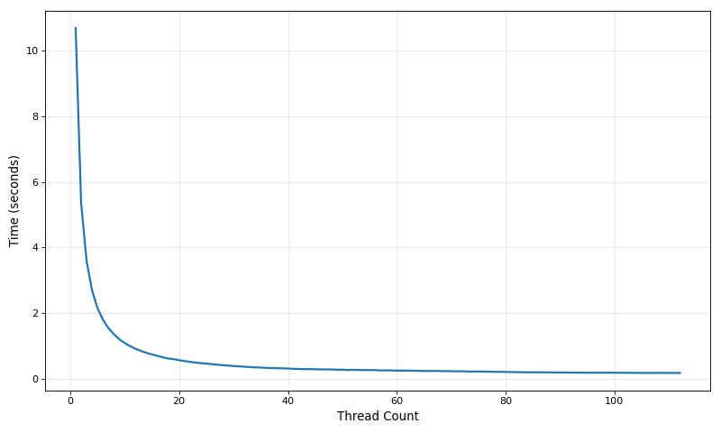
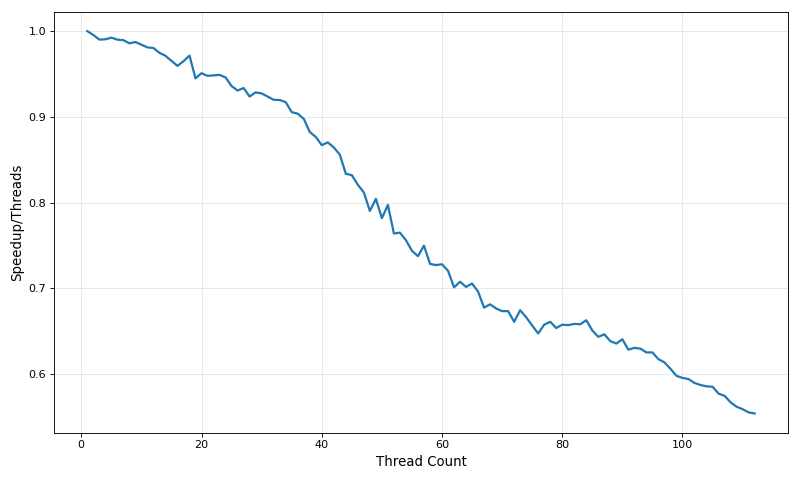

## The Starting Point And Making A Plan

My [best single-threaded solution](/posts/1brc_part1/#final-results-for-part-1---612-seconds) completes 6.18 seconds on my laptop using a single thread (8 seconds with the CPU locked to 3.5GHz for stable benchmarks).  
Despite the entire optimization journey in part 1, the general flow remains the same:

1. For every line of text:
    1. Split the line into station name and measurement.
    1. Parse the measurement.
    1. Update the current summary to include the new measurement.
1. Sort the summary by station name.
1. Print the results.

The best way to incorporate parallelism into this flow would be to split the entire text into chunks, so each chunk can be read and processed concurrently, and the measurements read from each chunks must still be summarized into the same final output.

Splitting the text is not as simple as dividing the length by the amount of chunks we want and setting the index there, because splitting in the middle of a line will make parsing it impossible.  
That means that we must only split at the end of lines. This can be done by looking around the split location we computed and adjusting it to the next/previous line break.

Additionally, combining the results also needs some consideration:  
One option is to share the hash map containing the information gathered so far between all the threads, which means there must be some synchronization in the access to them, either via a simple lock wrapping the hash map, or using a different hash map built specifically for concurrent access.  
Alternatively, each thread can maintain its own hash map, and we would need to combine all the hash maps after all the text has been processed. This solution eliminates all synchronization during the processing.
I predict the latter will be the faster option by far, but I will test both.

## Benchmarking Methodology

My methodology in this part is unchanged from [part 1](/posts/1brc_part1/#benchmarking-methodology), except that we need to stop restricting the program to a specific core.  
So unless stated otherwise, the benchmarks shown will run on the same specs as shown in part 1, with the CPU frequency locked to 3.5GHz.  
With the CPU frequency locked to 3.5GHz, the best single-threaded run time was 8.33 seconds.


## Splitting The Text

Splitting the text involves picking some "ideal" splitting point and then adjusting it to be at a line break.  
Additionally, each chunk needs 32 extra bytes to avoid undefined behaviour in `read_line`.  
I decided to do the splitting on the main thread and not in each thread because the amount of time spent splitting is immeasurably small and it is simpler to do.  
If I split in each thread individually, each thread would need to compute both of its edges since it can't rely on already knowing the end of the previous chunk.  
So my solution to give each thread the correct chunk looks like this:  

```rust
    std::thread::scope(|scope| {
        for _ in 0..thread_count - 1 {
            let chunk_end = memrchr(b'\n', &remainder[..ideal_chunk_size]).unwrap();
            let chunk: &[u8] = &remainder[..chunk_end + 33];
            remainder = &remainder[chunk_end + 1..];
            scope.spawn(|| process_chunk(chunk, &summary));
        }
        process_chunk(remainder, &summary);
    });
```

I am adding 33 bytes to the chunk end to include the line break, and an extra 32 bytes for the same reason as the entire file was mapped with an extra 32 bytes: to allow us to safely load 256 bits into a vector register.

`process_chunk` contains the main loop from the single-threaded solution.  

Since the main thread doesn't have anything else to do while the rest are processing, I let it process the last chunk.

`thread_count` is obtained from a simple command line argument:
```rust
  let thread_count: usize = std::env::args()
      .nth(1)
      .expect("missing thread count")
      .parse()
      .expect("invalid thread count");
```

Now I can get to actually parallelizing the work.

## Simple Mutex

My first parallel solution was written only to verify the splitting works correctly, so I kept it simple and wrapped `summary` hash map with a Mutex:

```rust {hl_lines=[1,8,9]}
fn process_chunk(chunk: &[u8], summary: &Mutex<FxHashMap<StationName, (i32, i32, i32, i32)>>) {
    let mut remainder = chunk;
    while (remainder.len() - 32) != 0 {
        let station_name: StationName;
        let measurement: i32;
        (remainder, station_name, measurement) = unsafe { read_line(remainder) };
        summary
            .lock()
            .unwrap()
        ...
    }
}
```
I also had to mark the pointer inside `StationName` as `Send`, because we know every thread has access to the text that the pointer points to, but the compiler does not know that:
```rust
unsafe impl Send for StationName {}
```

Because the hash map is constantly accessed I already expected it to be far slower, but I measured it with different amounts of threads anyway.  

This time I only ran each once since they take so long getting an accurate measurement is not important.  

| Threads  | 1    | 2  | 4   | 6   |
| -------- | ---- | -- | --- | --- |
| Time (s) | 15.6 | 72 | 121 | 193 |

Clearly, in this case more cores do not mean better performance.  
Looking at a profile of the program, even with a single thread, the added locking and unlocking of the mutex takes **60%** of the time, and with more threads it gets even worse, taking 90% with 2 threads and 96% with 4.  

## DashMap

`DashMap` is a Rust crate that provides a concurrent hash map and it utilizes sharding to achieve that.  

### Sharding

The way `DashMap` works, is that it contains many smaller single-threaded hash maps called shards, each wrapped by a `RWLock`.  
When trying to access a key in the `DashMap`, it determines the relevant shard and only locks it and not other shards.  
That means that if 2 or more threads are trying to access different keys that are stored in different shards, they can do so concurrently.  
Additionally, the hash calculation is done before any lock is acquired, which makes the critical section even smaller.  
When working with locks, the critical section that is guarded by a lock generally can't be improved by adding more threads, so it is important to make it as small as possible.  

### Using DashMap

`DashMap` was specifically designed to provide a very similar API to the standard hash map, so the only changes needed are: replacing the type with `DashMap`, remove the calls to lock that we added in the previous section, and make `StationName` also `Sync`.

And the results are significantly better, but still not beating the single-threaded performance:  

| Threads  | 1    | 2    | 4    | 6    | 8    | 10   | 12   | 14   | 16   |
| -------- | ---- | ---- | ---- | ---- | ---- | ---- | ---- | ---- | ---- |
| Time (s) | 14.4 | 17.8 | 13.7 | 11.7 | 10.6 | 10.3 | 9.9  | 11.1 | 12.6 |

Next, I am going back to single-threaded maps to actually achieve higher performance.

#### Heterogeneous CPUs

One major downside of the very simple method of splitting the text I used, is that all the chunks are effectively equal in size.  
This would be fine if the cores were also equal in performance, but this CPU is equipped with both performance and efficiency cores.  
More specifically, it is equipped with 6 performance cores with higher boost frequencies capable of hyper-threading, and 10 efficiency cores with lower boost frequencies and no hyper-threading.  
At the moment all the cores are running at the same frequency so the performance difference is much smaller, but the final time is still limited by the single thread that takes the most time to finish its chunk.  
I will ignore this problem for now, as a more dynamic splitting that accounts for faster threads is more complicated and requires more synchronization overhead.  
Additionally, later I will switch to a different system where all of the cores are equal, minimizing this issue further.


## Back To Single Threaded Hash Maps

Concurrent hash maps are useful when the different worker threads actually care what the other threads put in the hash map, but that is not the case here.  
For this challenge, every thread can work on its own, generating its own summary without any synchronization with other threads.  
That will result in generating a summary per thread, each containing at most a few hundred stations.  
Then, the main thread can combine these summaries relatively cheaply and produce the final result.  

Combining the different hash maps looks very similar to how they were built to begin with, except the count is increased by the amount of time that station was seen, and not just by 1:

```rust
fn merge_summaries(
    summary: &mut FxHashMap<StationName, StationEntry>,
    partial_summary: FxHashMap<StationName, StationEntry>,
) {
    partial_summary
        .into_iter()
        .for_each(|(station_name, partial_entry)| {
            summary
                .entry(station_name)
                .and_modify(|entry| {
                    if partial_entry.min < entry.min {
                        entry.min = partial_entry.min;
                    }
                    if partial_entry.max > entry.max {
                        entry.max = partial_entry.max;
                    }
                    entry.sum += partial_entry.sum;
                    entry.count += partial_entry.count;
                })
                .or_insert(partial_entry);
        });
}
```

So all the main thread needs to do is take the hash map from every other thread and combine it with its own hash map:  
```rust {hl_lines=[1,6,9,10,11]}
let mut threads = Vec::with_capacity(thread_count);
for _ in 0..thread_count - 1 {
    let chunk_end = memrchr(b'\n', &remainder[..ideal_chunk_size]).unwrap();
    let chunk: &[u8] = &remainder[..chunk_end + 33];
    remainder = &remainder[chunk_end + 1..];
    threads.push(scope.spawn(|| process_chunk(chunk)));
}
let mut summary = process_chunk(remainder);
for t in threads {
    merge_summaries(&mut summary, t.join().unwrap());
}
```

And as expected, this solution works much better (these *were* measured with `hyperfine`):

| Threads  | 1    | 2     | 4    | 6    | 8    | 10   | 12   | 14   | 16   | 18   | 20   | 22   |
| -------- | ---- | ----- | ---- | ---- | ---- | ---- | ---- | ---- | ---- | ---- | ---- | ---- |
| Time (s) | 8.02 | 4.06  | 2.12 | 1.46 | 1.44 | 1.25 | 1.10 | 1.01 | 0.96 | 0.89 | 0.86 | 0.88 |

And we finally crossed the 1 second barrier!  

Looking at the run times we got, we can see that the performance is equal to the single-threaded performance with 1 thread, which means no overhead was added.  
Additionally, the performance scaled almost perfectly up to 6 threads and then the scaling started to slow down. This matches with the fact that this laptop has exactly 6 performance cores.

And with the CPU frequency unlocked it gets much faster at lower thread counts and very slightly faster at higher thread counts:

| Threads  | 1    | 2    | 4    | 6    | 8    | 10   | 12   | 14   | 16   | 18   | 20   | 22   |
| -------- | ---- | ---- | ---- | ---- | ---- | ---- | ---- | ---- | ---- | ---- | ---- | ---- |
| Time (s) | 6.02 | 3.15 | 1.78 | 1.30 | 1.30 | 1.13 | 1.02 | 0.95 | 0.91 | 0.86 | 0.84 | 0.83 |

Again, the slower efficiency cores do not gain a lot from the uncapped frequency, and they are slowing down the total run time.  
In addition to the unequal cores that are used when using more threads, this can also be explained by looking at the power usage and frequencies of the CPU, it appears that past 6 threads the frequencies get throttled by missing power, as the power usage hits 41W and doesn't rise further no matter how many threads participate.

## Splitting The Work More Efficiently

The easiest way to split up the work in a way that doesn't slow us down to the performance of the slowest thread, is to split it into many more chunks, and letting each thread process chunks whenever they are ready.  
That means that faster threads will end up processing more chunks compared to slower threads, but that they will end up finishing at roughly the same time.

So instead of giving every thread the same amount of work, I want to split the work in a way that every thread will work for the same amount of *time*.

To make it easy to distribute the work, I used the `rayon` crate, which is the most popular package for concurrent programming in Rust.

Incorporating `rayon` into the existing code include mostly replacing thread creation with turning the chunks into an iterator and giving the iterator to `rayon` to parallelize:
```rust
// use_rayon.rs
rayon::ThreadPoolBuilder::new()
    .num_threads(thread_count)
    .build_global()
    .unwrap();
let chunks_mult = 16;
let chunks = thread_count * chunks_mult;
let ideal_chunk_size = mapped_file.len() / chunks;
let mut remainder = mapped_file;
let summary: FxHashMap<StationName, StationEntry> = (0..chunks)
    .map(|_| {
        let chunk_end = memrchr(b'\n', &remainder[..ideal_chunk_size]).unwrap();
        let chunk: &[u8] = &remainder[..chunk_end + 33];
        remainder = &remainder[chunk_end + 1..];
        chunk
    })
    .par_bridge()
    .map(process_chunk)
    .reduce(
        FxHashMap::<StationName, StationEntry>::default,
        merge_summaries,
    );
```

Now, instead of creating exactly as many chunks as we have threads, I am creating `chunks_mult` chunks per thread.  
I choose to use 16 for a balance between a high chunk size creating unequal thread run times, and a low chunk size adding overhead.  
In general, the less predictable the run time is, the more a higher granularity (amount of chunks) will help balance the work.

And now, benchmarking it again (still with unlocked frequencies):

| Threads  | 1    | 2    | 4    | 6    | 8    | 10   | 12   | 14   | 16   | 18   | 20   | 22   |
| -------- | ---- | ---- | ---- | ---- | ---- | ---- | ---- | ---- | ---- | ---- | ---- | ---- |
| Time (s) | 6.05 | 3.20 | 1.78 | 1.30 | 1.14 | 1.02 | 0.94 | 0.86 | 0.84 | 0.81 | 0.78 | 0.77 |

It appears that there is a small overhead added, which slightly slows down the program with 1 or 2 threads.  
With 8 or more threads is when the gains from having a higher granularity appear, as all of the results are faster than before.

The higher granularity allowed the faster threads to work on more chunks than the slower threads, leading to a lower time to complete all the chunks.

I am not going to bother with locking the frequencies in any of the future benchmarks.

I now have access to a more powerful system to experiment with, so let's try it.

## Better Hardware For Better Performance

The new system is equipped with 2 Xeon Gold 5420+ CPUs.  
Each of these CPUs has 28 cores capable of hyper-threading, for a total of 112 threads.  
These CPUs also support the AVX512 extension.  
I also do not expect to run into power and heat issues this time.  
Unfortunately, there are also a couple downsides:  
The new CPUs are clocked lower, at a 2.0 GHz base and 4.1 GHz turbo frequency, and they are built on the older Intel 7 process, compared to the higher clocks and Intel 4 used for the system I used so far.  
That means that the single-threaded performance will likely be slower, but with so many cores I expect the multi-threaded performance to far outweigh these downsides.

The cores on these CPUs are also equal to each other, which means there will be a much smaller difference in the time taken to process each chunk and the benefit from switching to `rayon` will shrink.

First, I wanted to check the performance of the single-threaded solution (`final_single_thread.rs`) on the new system:
```bash
Time (mean ± σ):     10.752 s ±  0.018 s    [User: 10.168 s, System: 0.583 s]
Range (min … max):   10.729 s … 10.787 s    10 runs
```

As expected, the single-threaded performance is much worse now.

And now for multi-threaded benchmarks.

### Benchmarking Many Times

To avoid manually running a benchmark for every possible amount of threads, `hyperfine` allows setting parameters it will automatically scan over, and it also allows outputting the results into JSON to be parsed by tools and scripts.

So to run `hyperfine` with every amount of threads between 1 and 112:

```bash
hyperfine -w 1 -m 10 -P threads 1 112 --export-json bench.json './target/max/one-billion-row-challenge {threads}'
```

To extract just the amount of threads and mean time I used `jq`, a JSON parsing CLI:

```bash
jq -r '.results[] | "\(.parameters.threads):\(.mean)"' bench.json
```

And because these are way too many results to put on in a table, I generated a simple graph for it using Python:


This graph shows that there using more threads is definitely  much faster, but the speedup is not the ideal linear growth:  


Using all 112 is still very fast, taking only 323 ms, and beating all previous results (new benchmark with more runs):
```bash
Time (mean ± σ):     323.7 ms ±   2.7 ms    [User: 16596.7 ms, System: 1063.1 ms]
Range (min … max):   319.5 ms … 333.9 ms    50 runs
```

So it is time to look for what overhead can be eliminated.

## Looking For The Overhead

I first tried running the non-`rayon` version to see whether `rayon` is making the performance worse with its work splitting system.

The performance without `rayon` was actually slightly worse, so that is not it:
```bash
Benchmark 1: ./target/max/one-billion-row-challenge 112
  Time (mean ± σ):     330.4 ms ±   9.2 ms    [User: 16311.1 ms, System: 919.7 ms]
  Range (min … max):   311.6 ms … 346.0 ms    20 runs
```

After some profiling that showed no new information, I added a simple time measurement inside the main function instead of measuring via `hyperfine`:
```rust
fn main() {
    let start = Instant::now();
    use_rayon::run();
    let dur = start.elapsed().as_micros();
    eprintln!("{}", dur);
}
```
(using the standard error output to separate it from the answer printed into the standard output)

Across 10 runs, the average timing for this is 687ms on the laptop, and 173ms on the server.  
That means that almost half of the time on the server is spent before and after the main function.  
By manually unmapping the file before returning from `run`, I saw the measured time with this method became equal to the results from `hyperfine`.  
That means the almost half of the run time measured by `hyperfine` is spent unmapping the file when the process exits.  
That also explains unexpectedly low speedup from using so many threads.

Unmapping the file is a serial computation and removing it from the measurement on the graph will show the speedup given by multithreading in the rest of the program, which I have more control over.  
That will show how close the rest of the program is to a linear speedup.

So I measured each thread count 20 times again using a short bash script:
```bash
 #!/bin/bash
for threads in {1..112}; do
    sum=0
    for run in {1..20}; do
        time=$(./target/max/one-billion-row-challenge $threads 2>&1 1>/dev/null )
        sum=$(awk "BEGIN {print $sum + $time}")
    done
    avg=$(awk "BEGIN {printf \"%.3f\", $sum / 20}")
    echo "$threads,$avg"
done
```

And then plotted the results:





Still not a linear speedup but better than before.


## Eliminating The File Unmapping Time

I really wanted to eliminate this time, and noticed that in the original challenge, some of the Java solutions used a separate worker process to do the work as a trick to not count the unmapping time.

To achieve a similar result in Rust I used this solution:

```rust
fn main() {
    let (mut reader, writer) = std::io::pipe().unwrap();
    if unsafe { libc::fork() } == 0 {
        use_rayon::run(writer);
    } else {
        _ = reader.read_exact(&mut [0u8]);
    }
}
```

And I added this to the end of `run`:
```rust
_ = out.flush();
writer.write_all(&[0]).unwrap();
```

What happens here is that the child process does all the work and prints the result, and then notifies the parent that it may exit.  
Without waiting for the child process to notify it, the parent will immediately exit with an empty output.  
At that point the time will be measured, even with the child still running.  
The child will then exit and spend some time unmapping the file.  

> [!Info] The `fork` System Call
> The `fork` system call duplicates the current process, creating a child process (and the original process is called the parent process).
> The child process is almost entirely identical to the original process, with the main distinction being that the `fork` call returns 0 to the child, and the process ID of the child to the parent.  
> `fork` is most often used to start new programs by immediately calling `exec` to replace the child with a different program.  
> But in this case, we actually want the child to be a worker process for the parent.  
> The parent and child start with identical memory, but they do not share it. That is why we need to use a pipe to communicate between them.  
> A pipe is seen as a file that can be written to by one process and read by the other.  

> [!WARNING] Unix Only
> the `fork` system call is only available on Unix-like systems (Linux/macOS), making this version incompatible with Windows (unless using Cygwin's implementation)

This optimization is relevant for both single and multi-threaded solutions, so I will benchmark it in both cases on both systems:

The single-threaded solution is not entirely "single-threaded" anymore because it uses 2 process, but even running both on a single logical core will have the same results (since the parent process is not doing anything), so I think it still counts.

Laptop, single-threaded:
```bash
Time (mean ± σ):      6.012 s ±  0.061 s    [User: 0.001 s, System: 0.002 s]
Range (min … max):    5.902 s …  6.073 s    10 runs
```

Laptop, 22 threads:
```bash
Time (mean ± σ):     704.3 ms ±   7.2 ms    [User: 0.5 ms, System: 1.8 ms]
Range (min … max):   693.1 ms … 716.3 ms    10 runs
```

Server, single-threaded:
```bash
Time (mean ± σ):     10.604 s ±  0.025 s    [User: 0.000 s, System: 0.002 s]
Range (min … max):   10.574 s … 10.657 s    10 runs
```

Server, 112 threads:
```bash
Time (mean ± σ):     175.0 ms ±   1.6 ms    [User: 0.4 ms, System: 1.6 ms]
Range (min … max):   171.5 ms … 178.2 ms    50 runs
```

All of them lost 70-150ms, but in the multi-threaded cases that is a lot of time, especially on the server where almost half of the time disappeared!

Now, after utilizing the many threads available on this CPU, I will try to utilize the new AVX512 instructions that are available on it.

## AVX512

It is worth noting that because my cargo configuration is set to automatically compile for that existing CPU features, the compiler was already able to utilize AVX512 instructions where it saw fit without any more intervention from me. And as I'll show later, it did in at least one spot.

The main improvement in AVX512 is the new 512 bit registers, that means every SIMD operation can potentially operate on twice as much data compared to the 256 bit registers in AVX2.  
Unfortunately, these operations tend to be slower on some CPU models, so they often don't reach quite 2x the performance even with ideal data access.

My first attempt at speeding up the program was rewrite the line splitting logic to do 2 lines at a time.  
Using the assumption that every line station name is at least 3 bytes, we can always skip the first 3 bytes.  
Using the assumption that every line is at most 33 bytes, we can deduce that after skipping the first 3 bytes, at least 2 entire lines are in the next 64 bytes (33+33-3=63).  
So we can always extract 2 measurements from a read chunk of 64 bytes.  
The benefits from that are not huge, as we only slightly increase the potential for out-of-order execution between 2 lines, and in total work we saved one read per 2 lines (we did one larger read instead of 2 smaller ones).

So the rewritten logic is:

```rust
#[target_feature(enable = "avx512bw")]
fn find_line_splits(text: &[u8]) -> (usize, usize, usize, usize) {
    let separator: __m512i = _mm512_set1_epi8(b';' as i8);
    let line_break: __m512i = _mm512_set1_epi8(b'\n' as i8);
    let line: __m512i = unsafe { _mm512_loadu_si512(text.as_ptr() as *const __m512i) };
    let separator_mask = _mm512_cmpeq_epi8_mask(line, separator);
    let line_break_mask = _mm512_cmpeq_epi8_mask(line, line_break);
    let separator_pos1 = separator_mask.trailing_zeros() as usize;
    let line_break_pos1 = line_break_mask.trailing_zeros() as usize;
    let var_name = separator_mask ^ (1 << separator_pos1);
    let separator_pos2 = var_name.trailing_zeros() as usize;
    let var_name1 = line_break_mask ^ (1 << line_break_pos1);
    let line_break_pos2 = var_name1.trailing_zeros() as usize;
    (
        separator_pos1,
        line_break_pos1,
        separator_pos2,
        line_break_pos2,
    )
}
fn process_chunk(chunk: &[u8]) -> FxHashMap<StationName, StationEntry> {
    let mut summary =
        FxHashMap::<StationName, StationEntry>::with_capacity_and_hasher(1024, Default::default());
    let mut remainder = chunk;
    while (remainder.len() - MARGIN) != 0 {
        let (separator_pos1, line_break_pos1, separator_pos2, line_break_pos2) =
            unsafe { find_line_splits(remainder) };
        let station_name1 = StationName {
            ptr: remainder.as_ptr(),
            len: separator_pos1 as u8,
        };
        let measurement1 = parse_measurement(&remainder[separator_pos1 + 1..]);
        let measurement2 = parse_measurement(&remainder[separator_pos2 + 1..]);
        add_measurement(&mut summary, station_name1, measurement1);
        let remainder1 = &remainder[line_break_pos1 + 1..];
        if (remainder1.len() - MARGIN) == 0 {
            // need to exit now if odd number of lines in the chunk
            break;
        }
        let station_name2 = StationName {
            ptr: unsafe { remainder.as_ptr().add(line_break_pos1 + 1) },
            len: (separator_pos2 - line_break_pos1 - 1) as u8,
        };
        add_measurement(&mut summary, station_name2, measurement2);
        remainder = &remainder[line_break_pos2 + 1..];
    }
    summary
}
fn add_measurement(
    summary: &mut FxHashMap<StationName, StationEntry>,
    station_name: StationName,
    measurement: i32,
) {
    summary
        .entry(station_name)
        .and_modify(|e| {
            if measurement < e.min {
                e.min = measurement;
            }
            if measurement > e.max {
                e.max = measurement;
            }
            e.sum += measurement;
            e.count += 1;
        })
        .or_insert(StationEntry {
            sum: measurement,
            min: measurement,
            max: measurement,
            count: 1,
        });
}
```

Resulting in the following times (using 112 threads):
```bash
Time (mean ± σ):     178.5 ms ±   1.4 ms    [User: 0.5 ms, System: 1.6 ms]
Range (min … max):   176.1 ms … 182.3 ms    50 runs
```

Very slightly slower than before..

I also tried replacing the compare and move-mask instructions in the original 256-bit line reading with the new mask variation that directly creates a mask:
```rust
let separator_mask = _mm256_mask_cmpeq_epu8_mask(!0, line, separator);
let line_break_mask = _mm256_mask_cmpeq_epu8_mask(!0, line, line_break);
```

But after inspecting the generated assembly it turns out the same instructions are generated in both cases (probably the compiler detecting the possible optimization with the previous code when AVX512 is available).

Next, I tried using masked instructions in the comparison function that takes a much more significant amount of the time:

```rust
#[target_feature(enable = "avx512bw,avx512vl")]
fn eq_inner(&self, other: &Self) -> bool {
    if self.len != other.len {
        return false;
    }
    let s = unsafe { _mm256_loadu_si256(self.ptr as *const __m256i) };
    let o = unsafe { _mm256_loadu_si256(other.ptr as *const __m256i) };
    let mask = (1 << self.len.max(other.len)) - 1;
    let diff = _mm256_mask_cmpneq_epu8_mask(mask, s, o);
    diff == 0
}
```


And that was slightly faster:

```bash
Time (mean ± σ):     172.9 ms ±   1.5 ms    [User: 0.6 ms, System: 1.4 ms]
Range (min … max):   170.1 ms … 176.8 ms    50 runs
```

I also tried using the masked load instructions available with AVX512 to only load relevant bytes:

```rust
let s = unsafe { _mm256_maskz_loadu_epi8(mask, self.ptr as *const i8) };
let o = unsafe { _mm256_maskz_loadu_epi8(mask, other.ptr as *const i8) };
```

But that was slightly slower:

```bash
Time (mean ± σ):     176.0 ms ±   1.8 ms    [User: 0.5 ms, System: 1.7 ms]
Range (min … max):   172.8 ms … 180.1 ms    50 runs
```

I don't have other ideas how to utilize AVX512 here, so only a very small gain was made, and that is my final time for the challenge.

To make it simpler to run, I combined both the AVX512 and the AVX2 multi-threaded solution into one file `combined_multi_thread` that chooses the relevant code at compile time:
```rust
    #[cfg(all(target_feature = "avx512bw", target_feature = "avx512vl"))]
    #[target_feature(enable = "avx512bw,avx512vl")]
    fn eq_inner(&self, other: &Self) -> bool {
        if self.len != other.len {
            return false;
        }
        let s = unsafe { _mm256_loadu_si256(self.ptr as *const __m256i) };
        let o = unsafe { _mm256_loadu_si256(other.ptr as *const __m256i) };
        let mask = (1 << self.len.max(other.len)) - 1;
        let diff = _mm256_mask_cmpneq_epu8_mask(mask, s, o);
        diff == 0
    }
    #[cfg(all(target_feature = "avx2", not(target_feature = "avx512bw")))]
    #[target_feature(enable = "avx2")]
    fn eq_inner(&self, other: &Self) -> bool {
        if self.len != other.len {
            return false;
        }
        let s = unsafe { _mm256_loadu_si256(self.ptr as *const __m256i) };
        let o = unsafe { _mm256_loadu_si256(other.ptr as *const __m256i) };
        let mask = (1 << self.len) - 1;
        let diff = _mm256_movemask_epi8(_mm256_cmpeq_epi8(s, o)) as u32;
        diff & mask == mask
    }
    #[cfg(not(target_feature = "avx2"))]
    fn eq_inner(&self, other: &Self) -> bool {
        let self_slice = unsafe { from_raw_parts(self.ptr, self.len as usize) };
        let other_slice = unsafe { from_raw_parts(other.ptr, other.len as usize) };
        self_slice == other_slice
    }
```

## A Custom Hash Map

Until now I relied on the standard library's implementation for the hash map (even when using other hash map crates, they only provided a different hashing function).  
Looking at a [flamegraph](flamegraph1.svg) of running a single thread shows that half of the time is spent in the hash map, and the only parts of it I improved so far was the hashing and comparison.  
The standard hash map is a general implementation that doesn't know anything about the expected maximum size, load, collisions, the default state we would want entries at, and that we do not intend to remove any items.  
By using this knowledge, we can create a simple hash map that is purpose built for *this* case.  

So what can we do with the knowledge we have?

- The challenge specifies at most 10,000 different station names, so we can allocate at least that size and never have to worry about running out of space.  
  The load can get high if we completely refuse to reallocate and get that many different station names, but in reality there are only 413 names so its okay.  
- Because we expect the common case to have little to no conflicts and to already be in the hash map, we don't need a complicated system that loads multiple tags and checks them like the standard implementation does.  
- To make computing the index from the hash faster, we should allocate a size with a power of 2, so at least 16K (2 to the power of 14).  
- It would be easier if all entries start from some default state of "no measurements" instead of branching on whether there is a state or not (but checking if the cell is "claimed" by a certain station name is still needed).  
- We will never delete items from the hash map, eliminating any need for mechanisms that handle it like gravestones or moving entries around to fill empty spots.

Using these, I created this simple hash map, that also incorporates updating measurements into its methods:

```rust
// my_hashmap.rs
pub struct MyHashMap {
    names: Box<[StationName; SIZE]>,
    entries: Box<[StationEntry; SIZE]>,
}
```
The names and entries are stored separately, measured to be considerably faster than storing them together.

```rust
impl MyHashMap {
    pub fn new() -> MyHashMap {
        let mut names;
        let mut entries;
        unsafe {
            names = Box::<[MaybeUninit<StationName>; SIZE]>::new_uninit().assume_init();
            entries = Box::<[MaybeUninit<StationEntry>; SIZE]>::new_uninit().assume_init();
        }
        for name in names.iter_mut() {
            name.write(StationName {
                ptr: null(),
                len: 0,
            });
        }
        for entry in entries.iter_mut() {
            entry.write(StationEntry {
                min: 1000,
                max: -1000,
                sum: 0,
                count: 0,
            });
        }
        MyHashMap {
            names: unsafe {
                transmute::<Box<[MaybeUninit<StationName>; SIZE]>, Box<[StationName; SIZE]>>(names)
            },
            entries: unsafe {
                transmute::<Box<[MaybeUninit<StationEntry>; SIZE]>, Box<[StationEntry; SIZE]>>(
                    entries,
                )
            },
        }
    }
```
The creation of the hash map is so complicated because `Box::new(from_fn(|| StationName{ptr:null(),len:0}))` creates the array on the stack and *then* copies it into the heap, causing a stack overflow.

```rust
    pub fn insert_measurement(&mut self, name: StationName, measurement: i32) {
        let mut hasher = FxHasher::default();
        name.hash(&mut hasher);
        let mut hash = hasher.finish() as usize;
        let entry = unsafe {
            loop {
                let index = hash & MASK;
                let potential_name = self.names.get_unchecked_mut(index);
                if potential_name.ptr.is_null() {
                    *potential_name = name;
                    break self.entries.get_unchecked_mut(index);
                }
                if *potential_name == name {
                    break self.entries.get_unchecked_mut(index);
                }
                hash = hash.wrapping_add(1);
            }
        };
        entry.sum += measurement;
        entry.count += 1;
        if measurement > entry.max {
            entry.max = measurement;
        }
        if measurement < entry.min {
            entry.min = measurement;
        }
    }
    pub fn merge_entry(&mut self, name: &StationName, other_entry: &StationEntry) {
        let mut hasher = FxHasher::default();
        name.hash(&mut hasher);
        let mut hash = hasher.finish() as usize;
        let entry = unsafe {
            loop {
                let index = hash & MASK;
                let potential_name = self.names.get_unchecked_mut(index & MASK);
                if potential_name.ptr.is_null() {
                    *potential_name = *name;
                    break self.entries.get_unchecked_mut(index);
                }
                if *potential_name == *name {
                    break self.entries.get_unchecked_mut(index);
                }
                hash = hash.wrapping_add(1);
            }
        };
        entry.sum += other_entry.sum;
        entry.count += other_entry.count;
        entry.max = entry.max.max(other_entry.max);
        entry.min = entry.min.min(other_entry.min);
    }
```
Both of these are for ease of use with our specific use case of the hash map.

```rust
    pub fn iter(&self) -> impl Iterator<Item = (&StationName, &StationEntry)> {
        self.names
            .iter()
            .zip(self.entries.iter())
            .filter(|(name, _)| !name.ptr.is_null())
    }
}
```
Simple iteration for the conversion and output at the end.

I also moved the `StationName` and `StationEntry` into the same file.

Rerunning the 4 benchmarks:

Laptop, single-threaded:
```bash
Time (mean ± σ):      5.724 s ±  0.067 s    [User: 0.001 s, System: 0.002 s]
Range (min … max):    5.628 s …  5.807 s    10 runs
```

Laptop, 22 threads:
```bash
Time (mean ± σ):     641.1 ms ±   6.4 ms    [User: 0.9 ms, System: 1.5 ms]
Range (min … max):   634.0 ms … 654.4 ms    10 runs
```

Server, single-threaded:
```bash
Time (mean ± σ):     10.100 s ±  0.011 s    [User: 0.001 s, System: 0.002 s]
Range (min … max):   10.090 s … 10.120 s    10 runs
```

Server, 112 threads:
```bash
Time (mean ± σ):     164.5 ms ±   3.3 ms    [User: 0.5 ms, System: 1.7 ms]
Range (min … max):   158.0 ms … 172.5 ms    50 runs
```

A little faster in all of them.

## A Perfect Hash Function

A Perfect Hash Function is a hash function that guarantees there are no collisions, that means that it will give a unique index for every key.  
When the key space is very large (like in the compliant rules), it is not feasible to find a perfect hash function.  
But when it is small enough, we can find it via brute force.  

So what are the properties of the key space?

- 413 keys, a pretty small space.
- The keys are byte slices mostly composed of ASCII letters (there are a few Unicode ones)
- The most problematic pair of keys similarity wise is `Alexandria` and `Alexandra`, which are identical for the first 8 bytes.

The current hash function only considers the first 4 bytes, so even before the modulus part of the function that maps the full `u64` hash to an index, the problematic pair already has the same `u64` hash.  
To fix this issue, I will instead consider the 2nd to 9th bytes, as there are no full equality pairs like that in those bytes.  

Next, to find the perfect hash function, I wrote a few variations of it and ran them through brute force search function such as this one:
```rust
fn get_name_sample(name: &[u8]) -> usize {
    const OFFSET: usize = 1;
    let ptr = unsafe { name.as_ptr().add(OFFSET) } as *const u64;
    let sample = unsafe { ptr.read_unaligned() };
    let len = (name.len() - 1).min(8);
    let to_mask = len * 8;
    let mask = u64::MAX >> (64 - to_mask);
    (sample & mask) as usize
}
pub fn find_seed_fxhash() {
    for divisor in 413..MAX_DIVISOR {
        (0..THREADS).into_par_iter().for_each(|tid| {
            let mut vec = vec![false; MAX_DIVISOR];
            for seed in (tid..10000).step_by(THREADS) {
                let mut found = true;
                for name in STATION_NAMES.iter() {
                    let sample = get_name_sample(name);
                    let mut hasher = FxHasher::with_seed(seed);
                    sample.hash(&mut hasher);
                    let hash = hasher.finish() as usize;
                    let vec_index = hash % divisor;
                    if !vec[vec_index] {
                        vec[vec_index] = true;
                    } else {
                        vec[..divisor].fill(false);
                        found = false;
                        break;
                    }
                }
                if found {
                    println!("Seed Found: {seed} with divisor: {divisor}");
                    unsafe { libc::exit(0) };
                }
            }
        });
        println!("Failed {divisor}");
    }
    println!("Failed");
}
```

Running this I found the successful seed 78 with `log_size` at 15, which means the hash map must have 32K slots for this to work.

I also found 2 other methods:

The first packs the 5 bits that are relevant in ASCII letters, which needs a `log_size` of 17:
```rust
let hash = unsafe {
    _pext_u64(
        masked_sample,
        0b00011111_00011111_00011111_00011111_00011111_00011111_00011111_00011111,
    ) as usize
};
```
And the second is the simple identity function:
```rust
let hash = masked_sample as usize;
```

Adding the seed to the `pext` or to the identity function literally has no effect on the collisions since they shift all collisions together, so instead I tried searching for a better divisor (the size is no longer a search parameter because it is equal to divisor):

For the identity function, `divisor=13779` works.  
For `pext`, `divisor=13167` works.  

Since changing the divisor helped so much, I added another loop to the original `FxHasher` search that tries different divisors:
```rust
for divisor in 413..(1 << 15) {
    (0..22).into_par_iter().for_each(|tid| {
        let mut vec = vec![false; 1 << 15];
            for seed in (tid..10000).step_by(22) {
          ...
```

This search found `divisor=7088, seed=1339`.

Initially I hoped to be able to find a function that uses a power of 2 divisor, which would be a lot faster. But none of my searches found one that works.  
Fortunately, modulus by a constant is optimized into a multiplication, so it is still pretty fast.

To pick between these a benchmark of each is required. That is because both the time to compute the index and the size of the table may have an effect.  
A larger table takes more memory, which means it will be harder to fit in cache and take more time to bring from memory to the cache.  
Fortunately, we never actually need the entire table, at most we will need 413 entries from it, which means 413 cache lines (64 bytes) from each of the arrays in the hash map.  
That many lines probably do fit in the cache, but we would also like to fit other things, so a more compact table that contains more than one relevant entry per cache line might help.

I expect the identity function to win this benchmark, since the sizes are relatively close to each other.

But first to write the new hash map:

### Updating The Hash Map:

Because all of the keys and their index are known ahead of time now (and we can access them freely in the `STATION_NAMES` array), we can completely remove the `names` array from the hash map. Already halving its size.  

That also means we don't need the `StationName` struct at all anymore.

The `insert_measurement` function no longer loops, because there will never be a collision (and there is no way to check if there is one anyway without the `names` array):
```rust
// my_phf.rs
pub fn insert_measurement(&mut self, name: &[u8], measurement: i32) {
    let index = get_name_index(name);
    let entry = unsafe { self.entries.get_unchecked_mut(index) };
    entry.sum += measurement;
    entry.count += 1;
    if measurement > entry.max {
        entry.max = measurement;
    }
    if measurement < entry.min {
        entry.min = measurement;
    }
}
```
`get_name_index` is the new hash function that need to be picked.

I replaced the `merge_entry` function with a function that merges 2 whole maps.  
Because the index belonging to each name is always the same, we can simply merge them using a simple scan over the arrays:
```rust
// my_phf.rs
pub fn merge_maps(&mut self, other_map: Self) {
    for (entry, other_entry) in self.entries.iter_mut().zip(other_map.entries.iter()) {
        if (entry.count != 0) | (other_entry.count != 0) {
            entry.sum += other_entry.sum;
            entry.count += other_entry.count;
            entry.max = entry.max.max(other_entry.max);
            entry.min = entry.min.min(other_entry.min);
        }
    }
}
```

To make things simpler, I also moved the result printing into the map:
```rust
// my_phf.rs
pub fn print_results(self) {
let mut out = std::io::stdout().lock();
let _ = out.write_all(b"{");
for station_name in STATION_NAMES[..STATION_NAMES.len() - 1].iter() {
    let name = unsafe { std::str::from_utf8_unchecked(station_name) };
    let index = get_name_index(station_name);
    let entry = unsafe { self.entries.get_unchecked(index) };
    if entry.count != 0 {
        let (min, avg, max) = entry.get_result();
        let _ = out.write_fmt(format_args!("{name}={min:.1}/{avg:.1}/{max:.1}, "));
    }
}
let station_name = STATION_NAMES[STATION_NAMES.len() - 1];
let name = unsafe { std::str::from_utf8_unchecked(station_name) };
let index = get_name_index(station_name);
let entry = unsafe { self.entries.get_unchecked(index) };
if entry.count != 0 {
    let (min, avg, max) = entry.get_result();
    let _ = out.write_fmt(format_args!("{name}={min:.1}/{avg:.1}/{max:.1}}}"));
}
_ = out.flush();
}
```
This prints in the right order because I already sorted the names in the constant `STATION_NAMES` array.


I'm using the new map in `use_phf.rs`

### Picking A Perfect Hash Function

By running each of the 3 options on the server with 112 threads we can pick the best one:

Identity function:
```bash
Time (mean ± σ):     154.8 ms ±   4.6 ms    [User: 0.4 ms, System: 1.7 ms]
Range (min … max):   145.3 ms … 163.3 ms    50 runs
```

`pext`:
```bash
Time (mean ± σ):     156.3 ms ±   4.6 ms    [User: 0.5 ms, System: 1.7 ms]
Range (min … max):   145.8 ms … 165.1 ms    50 runs
```

And with `FxHasher`:
```bash
Time (mean ± σ):     153.7 ms ±   4.2 ms    [User: 0.5 ms, System: 1.7 ms]
Range (min … max):   144.2 ms … 160.6 ms    50 runs

```
All three are measurably faster than before, but pretty much equal to each other (no statistically significant difference).  
I tried running the search for `FxHasher` with more seeds to find a lower divisor but could not find anything.  
Since we expect to only load up to 413 cache lines around the 413 station names and having 2 entries on the same line is fairly unlikely, the actual size of the table doesn't matter. So I picked the identity function

## Benchmarking A Compliant Multi-Threaded Solution

Like in part 1, I wanted to measure the cost of being fully compliant with the rules. Which means supporting 10000 different station names between 1 and 100 bytes.

By combining the final multi-threaded solution without the PHF (because its whole point was to utilize the name assumptions) and the exact same changes made in part 1 to make the final single-threaded solution compliant, I created a compliant multi-threaded solution.

Running this version on the laptop with 22 threads:

```bash
Time (mean ± σ):     956.8 ms ±   8.3 ms    [User: 0.4 ms, System: 1.9 ms]Range (min … max):   945.6 ms … 970.8 ms    10 runs
```

And on the server with 112 threads:
```bash
Time (mean ± σ):     212.0 ms ±   2.3 ms    [User: 0.4 ms, System: 1.6 ms]
Range (min … max):   209.7 ms … 221.4 ms    50 runs
```

## Failed Optimization

Like in the previous part, some of my attempts to improve the performance did not succeed:

- Pinning the threads to cores only caused performance to decrease significantly.
- I tried to incorporate prefetching into the code by prefetching the lookup table and the hash table indexes in one iteration and actually accessing them in the next iteration, but despite reducing the L1 miss rate from 11% to 0.7%, the run time and the `tma_l1_bound` metric did not measurably improve.

## Summary

In this part of the one billion rows challenge, I made my already pretty fast single-threaded solution even faster:

- I demonstrated a few ways to parallelize the work and use many threads, and as expected, the fastest way is the one that requires the least synchronization between the threads.  
- I started benchmarking on a server with far more cores than before.
- I offloaded the file unmapping to a different process since it started taking a very significant amount of the time.
- I used an AVX512 instruction available on the new system to shave off a couple more milliseconds.
- I wrote a new hash map designed specifically for this use case.
- I found a perfect hash function to make the hash map even faster.

After all of this work, I achieved a final time of 154 milliseconds to solve the one billion rows challenge.
